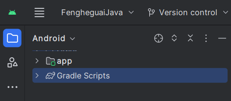
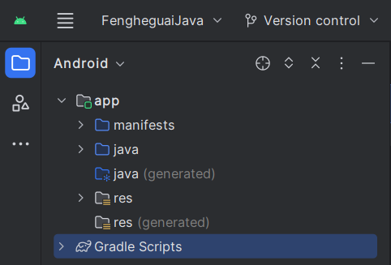
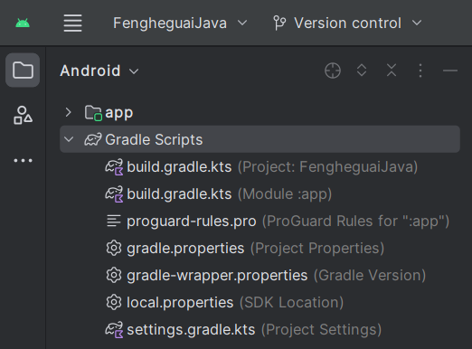

# Project Structure

主要分为 app 和 Gradle脚本。

## app

app目录下又分了几个目录：

**1. manifests** 

AndroidManifest.xml 配置清单文件。

**2. java**

目录下有3个同名的包，第一个存放Java源代码，后两个存放测试用代码。

**3. res**

存放当前模块的资源文件。
    
子目录有：
- *drawable*

    存放图形描述文件与图片文件。

- *layout*

    存放页面布局文件。

- *mipmap*

    存放APP启动图标。

- *values*

    存放一些常量定义文件。

## Gradle Script

主要是工程的编译配置文件。

**1. build.gradle**

分为项目级(Project) 模块级(Module)，用于描述工程编译规则。

**2. proguard-rules.pro**

用于描述Java代码的混淆规则。

*因为.apk可以被解压缩，能看到.class文件 经过混淆后一定程度上防止了反编译。*

**3. gradle.properties**

用于配置工程的命令行参数，一般无需改动。

JVM参数在这里设置。

**4. settings.gradle**

配置了需要编译哪些模块。初始为只编译'app'。

**5. local.properties**

项目的本地配置文件，包括SDK路径，NDK路径等。

