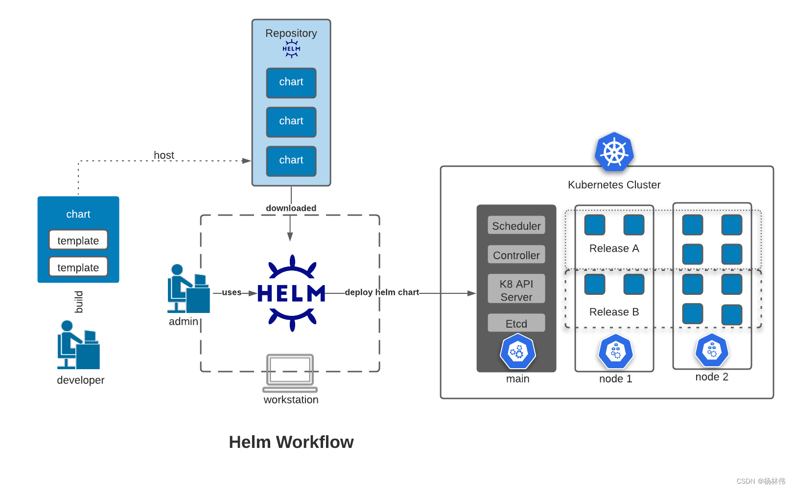
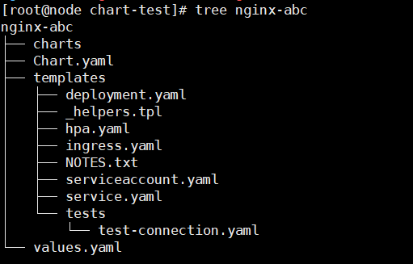
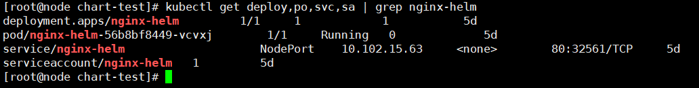
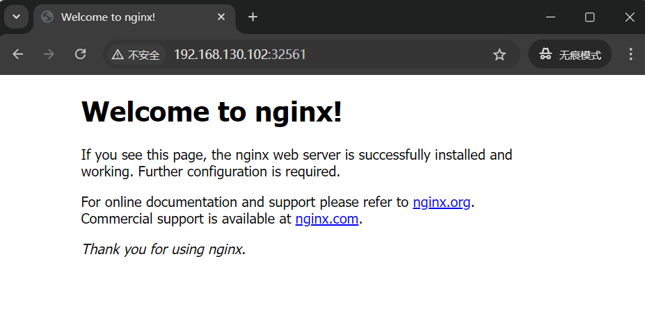

# Helm Chart

Helm install charts into K8s.

**用于简化K8s应用部署，省去了一直apply的繁琐步骤。**

Helm Chart与K8s的关系相当于：

- yum .rpm 与 CentOS

各种云平台的模板应用就是Helm Chart。

## Helm

***本质上就是一个K8s包管理器。***

Helm在v3版本之后，直接通过`kubeconfig`连接`apiserver`，简化安全模块，降低使用难度

### 主要能力：

- 简化K8s应用部署
- 高度可配置
- 版本控制
- 模块化
- 应用程序库
- 插件系统

### 工作流程



于是，Helm的基本使用步骤为

- 开发者首先创建并编辑chart的配置；
- 接着打包发布到Helm仓库；
- 管理员使用Helm命令从仓库下载依赖；
- Helm根据下载的依赖进行自动部署。

### 相关概念

|概念|描述|
|--|--|
|Charts|一个Helm包，包含了运行一个应用所需的镜像、依赖、资源定义等|
|Repository|仓库，存储Charts的地方|
|Release|Charts在K8s集群运行的一个实例，同一个Charts可以被多次安装，即为不同的Release|
|Value|Charts的参数，用于配置K8s对象|
|Template|使用Go模板语言自动生成K8s对象的定义文件|
|Namaspace|K8s中用于隔离资源的逻辑分区|

## Helm安装

首先上官网下载压缩包：
```
https://github.com/helm/helm/releases
```

比如下载下来Linux x64系统的压缩包，名为
`helm-v3.15.3-linux-amd64.tar.gz`

传入K8s Master机器的一个位置，解压：

```bash
tar -zxvf helm-v3.15.3-linux-amd64.tar.gz
```

解压后的目录名为`linux-amd64`，下面有三个文件：

```bash
[root@node ~]# ls -l linux-amd64/
total 51236
-rwxr-xr-x 1 1001 docker 52445336 Jul 10 15:29 helm
-rw-r--r-- 1 1001 docker    11373 Jul 10 15:34 LICENSE
-rw-r--r-- 1 1001 docker     3483 Jul 10 15:34 README.md
```

helm为二进制可执行文件。将这个文件拷到/usr/bin下

```bash
cp linux-amd64/helm /usr/bin
```

输入如下命令

```bash
helm help
```

如果输出helm的使用帮助，即为安装完成

配置命令自动补全：
```bash
yum install bash-completion

source <(helm completion bash)
echo "source <(helm completion bash)" >> ~/.bashrc
```

## Helm使用

### 配置Charts公共仓库

```bash
# 官方仓库
helm repo add stable https://charts.helm.sh/stable

# azure仓库
helm repo add stable http://mirror.azure.cn/kubernetes/charts
```

出现：`"stable" has been added to your repositories`即为添加成功，“stable”是稳定版镜像仓库

可以添加多个Charts仓库。

使用`helm repo list`查看已经添加成功的仓库。

更新仓库本地缓存

```bash
helm repo update

[root@node ~]# helm repo update
Hang tight while we grab the latest from your chart repositories...
...Successfully got an update from the "stable" chart repository
Update Complete. *Happy Helming!*
```

查找仓库，安装Chart（举例）

```bash 
helm search repo mongodb

helm install mongodb-helm stable/mongodb
```

### 配置私有仓库

任何HTTP Server都可以作为Charts仓库。

比如用docker起一个容器作为Charts本地仓库：

*镜像：httpd (Apache http server) 或 nginx*


### 指定需要连接的K8s集群

在使用 Helm 管理 Kubernetes 集群的时候，需要指定对应的 Kubernetes 集群。

Helm 不像 kubectl 会默认从本地 kubeconfig 配置文件读取当前的 Kubernetes 集群信息。

Helm在执行各种命令时，需要知道这些命令要操作的是哪一个Kubernetes集群。Helm没有默认的集群配置。

没有目标集群，Helm命令将无效。

```bash
export KUBECONFIG=/root/.kube/config
echo "KUBECONFIG=/root/.kube/config" >> /etc/profile
source /etc/profile
```

以上命令将k8s的config文件加入了环境变量，helm会自动使用此配置文件连接集群。

### 创建Charts

使用以下命令创建Charts包：

```bash
helm create < Charts名 >
```

比如这里创建了一个名为nginx-abc的Charts:



*文件/目录说明*

|文件名/目录名|说明|
|--|--|
|charts|如果Charts是另一个Charts的依赖项，这个文件夹将包含依赖的Charts|
|Chart.yaml|包含Charts的元数据和依赖项，描述了Chart的基本信息|
|values.yaml|包含程序中用户可以覆盖的默认配置值|
|templates|通过values.yaml中填写的值自动配置部署进k8s的部署文件|

#### Chart.yaml

```yaml
apiVersion: chart API 版本 （必需）  #必须
name: chart名称 （必需）     # 必须
version: 语义化2 版本（必需） # 必须

kubeVersion: 兼容Kubernetes版本的语义化版本（可选）
description: 一句话对这个项目的描述（可选）
type: chart类型 （可选）
keywords:
  - 关于项目的一组关键字（可选）
home: 项目home页面的URL （可选）
sources:
  - 项目源码的URL列表（可选）
dependencies: # chart 必要条件列表 （可选）
  - name: chart名称 (nginx)
    version: chart版本 ("1.2.3")
    repository: （可选）仓库URL ("https://example.com/charts") 或别名 ("@repo-name")
    condition: （可选） 解析为布尔值的yaml路径，用于启用/禁用chart (e.g. subchart1.enabled )
    tags: # （可选）
      - 用于一次启用/禁用 一组chart的tag
    import-values: # （可选）
      - ImportValue 保存源值到导入父键的映射。每项可以是字符串或者一对子/父列表项
    alias: （可选） chart中使用的别名。当你要多次添加相同的chart时会很有用

maintainers: # （可选） # 可能用到
  - name: 维护者名字 （每个维护者都需要）
    email: 维护者邮箱 （每个维护者可选）
    url: 维护者URL （每个维护者可选）

icon: 用做icon的SVG或PNG图片URL （可选）
appVersion: 包含的应用版本（可选）。不需要是语义化，建议使用引号
deprecated: 不被推荐的chart （可选，布尔值）
annotations:
  example: 按名称输入的批注列表 （可选）.
```

#### values.yaml

```yaml
# Default values for nginx-abc.
# This is a YAML-formatted file.
# Declare variables to be passed into your templates.

replicaCount: 1 # 实例数量

namespace: "" # 指定部署命名空间

image:
  repository: xxx/nginx # 镜像仓库url
  pullPolicy: IfNotPresent # 镜像拉取策略
  # Overrides the image tag whose default is the chart appVersion.
  tag: "1.23.2" # 镜像tag

imagePullSecrets: [] # 镜像拉取Secret
nameOverride: ""
fullnameOverride: "nginx-helm" # 覆盖名称，对部署后的所有资源生效，包括deploy、po、svc、sa

# 可以选择是否创建service account
serviceAccount:
  # Specifies whether a service account should be created
  create: true
  # Automatically mount a ServiceAccount's API credentials?
  automount: true
  # Annotations to add to the service account
  annotations: {}
  # The name of the service account to use.
  # If not set and create is true, a name is generated using the fullname template
  name: ""

podAnnotations: {} # 一般不用写
podLabels: {} # 如果需要用lable区分再写

podSecurityContext: {}
  # fsGroup: 2000

securityContext: {}
  # capabilities:
  #   drop:
  #   - ALL
  # readOnlyRootFilesystem: true
  # runAsNonRoot: true
  # runAsUser: 1000

# 部署service的配置
service:
  type: NodePort
  nodePort: 8091
  port: 80

# 可选部署负载均衡器
ingress:
  enabled: false
  className: ""
  annotations: {}
    # kubernetes.io/ingress.class: nginx
    # kubernetes.io/tls-acme: "true"
  hosts:
    - host: chart-example.local
      paths:
        - path: /
          pathType: ImplementationSpecific
  tls: []
  #  - secretName: chart-example-tls
  #    hosts:
  #      - chart-example.local

# pod请求资源限制
resources: {}
  # We usually recommend not to specify default resources and to leave this as a conscious
  # choice for the user. This also increases chances charts run on environments with little
  # resources, such as Minikube. If you do want to specify resources, uncomment the following
  # lines, adjust them as necessary, and remove the curly braces after 'resources:'.
  # limits:
  #   cpu: 100m
  #   memory: 128Mi
  # requests:
  #   cpu: 100m
  #   memory: 128Mi

livenessProbe:
  httpGet:
    path: /
    port: http
readinessProbe:
  httpGet:
    path: /
    port: http

autoscaling:
  enabled: false
  minReplicas: 1
  maxReplicas: 100
  targetCPUUtilizationPercentage: 80
  # targetMemoryUtilizationPercentage: 80

# Additional volumes on the output Deployment definition.
# 配置卷
volumes: []
# - name: foo
#   secret:
#     secretName: mysecret
#     optional: false

# Additional volumeMounts on the output Deployment definition.
# 卷挂载
volumeMounts: []
# - name: foo
#   mountPath: "/etc/foo"
#   readOnly: true

nodeSelector: {} # 节点调度器，标签

tolerations: [] # 污点

affinity: {} # 节点亲和力
```

一般要修改的就这两个文件。

### 打包Charts

在修改好`Chart.yaml`和`values.yaml`后，使用以下命令打包：

```bash
helm package <包名>
```

这将会生成一个`包名-tag.tgz`的`tarball`文件。

### 发布Charts（可选）

将打包好的Charts发布到一个Helm Repo中。

```bash
helm push xxx.tgz <仓库名>
```

### 安装Release

使用`helm install`安装Release。

```bash
helm install <Release名> <仓库名/Charts名>

# 或本地安装
cd <Charts路径>
helm install <Release名> ./
```

### 查看部署详情

**使用kubectl查看：**

```bash
kubectl get deploy,po,svc,sa | grep <Release名>
```



访问部署成功的nginx服务：



**使用helm查看：**

```bash 
helm ls

[root@node chart-test]# helm ls
NAME      	NAMESPACE	REVISION	UPDATED                                  	STATUS  	CHART           	APP VERSION
nginx-helm	default  	1       	2024-10-08 22:50:32.337382538 -0400 -0400	deployed	nginx-abc-1.23.2	1.16.0     
```

### 管理Release

**升级**

```bash
helm upgrade <Release名> [<仓库名/Charts名> | ./ ]
```

**回滚**

```bash
helm rollback <Release名> <版本>
```

**删除（卸载）**

```bash
helm uninstall <Release名>
```

### 更新Charts步骤

1. 在本地编辑Charts配置或添加新的依赖项；

2. 使用`helm package`打包新的Charts；

3. 使用`helm push`将新的Charts推送到Repo；

4. 使用`helm repo update`更新本地或远程的Helm Repo；

5. 使用`helm upgrade`升级现有Release到新版本。


