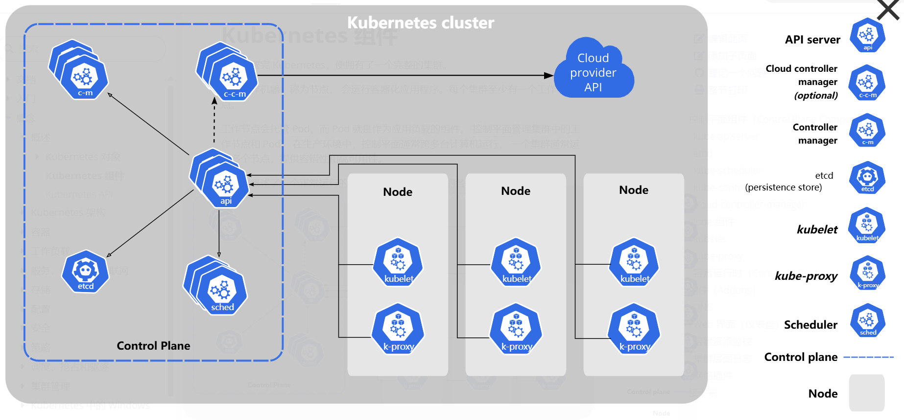

# Kubernetes概述

Kubernetes(k8s)是一个容器编排应用，云工作节点管理应用。

k8s与docker一样，是Golang语言开发的顶级项目。

## 背景

云原生开发，DevOps，CI/CD需求

### CI/CD

CI: 持续集成，Continuous Integration
CD：持续交付，Continuous Delivery

### DevOps

DevOps = Development + Operations

- 打破了开发与运维之间的壁垒
- 自动化CI/CD
- 利用容器化实现快速部署
- 数据驱动

工具：

* Jenkins
* Gitlab
* Docker/Containered
* Kubernetes

# Kubernetes组件

当部署完K8s，则拥有了一个完整的集群。

集群中的机器称为工作节点，会容器化运行应用程序。

*每个集群至少有一个工作节点。*



## 控制平面组件 Control Plane Components

### kube-apiserver

apiserver负责公开K8s API，负责处理接受请求的工作。

*apiserver是K8s控制平面的前端。*

设计上考虑了水平扩缩，可以运行多个kube-apiserver的实例来实现负载均衡。

*即部署多个master节点。*

任务：

- 提供集群的RESTful API供外部或其他组件使用；

    *比如可以外部访问https://masterip:6443，通常返回403*

- 处理客户端的请求，包括创建、读取、更新和删除资源；

- 验证和授权请求，确保只有合适的用户和应用程序可以执行操作；

- **将集群变更信息写入etcd。**

### etcd

一致且高可用的**分布式***键值对*存储，作为K8s所有集群数据的DB。

*一般k8集群备份就备份etcd。*

### kube-scheduler

负责监视新创建的Pod，并选择节点来让Pod运行。

### kube-controller-manager

负责运行**控制器进程**。

从逻辑上说，每个控制器都是一个单独的进程，但是为了降低复杂性，所有控制器都被编译到一个可执行文件，并在同一个进程中运行。

有许多不同类型的控制器：

- 节点控制器 Node Controller

    负责在节点出现故障时通知响应。

- 任务控制器 Job Controller

    监测Job对象（一次性任务），然后创建Pod来运行这些任务直到完成。

- 端点分片控制器 EndpointSlice Controller
- 服务账号控制器 ServiceAccount Controller

    为新的namespace创建默认服务账号。

### kubectl

命令行工具。通过kubectl对apiserver操作，apiserver相应并返回操作的结果。

### cloud-controller-manager

云控制器管理器允许将本地集群连接到云提供商的 API 之上，并将与该云平台交互的组件同与本地集群交互的组件分离开来。

## Node组件

### kubelet

在每个Node中都有，保证容器运行在Pod中。

负责容器真正运行的核心组件。

- Pod创建，修改，监控，删除等生命周期管理
- 定时上报本地Node信息给apiserver
- 与apiserver通信管理其他组件

### kube-proxy

每个Node上运行的网络代理，维护Node上的一些网络规则。

一般情况下Kube-proxy只做流量转发。

### Container Runtime

负责管理K8s环境中容器的执行和生命周期。

K8s支持很多运行时环境，如`containered`，`CRI-O`以及`Kubernetes-CRI`的其他任何实现。

## 核心资源对象

### Pod

一组紧密关联的容器集合，这些容器共享PID，IPC，网络和命名空间，是k8s调度的基本单位。

*容器本质上就是进程。*

创建Pod的基本流程：

- 用户通过REST api创建一个Pod
- apiserver将这个Pod写入etcd
- scheduler将这个Pod绑定给Node
- kubelet检测到有Pod，通过容器运行时启动Pod
- kubelet通过容器运行时取到Pod状态，并更新到apiserver中

### Label

Label是识别k8s对象的标签，以键值对的方式附加到对象上。

Label不提供唯一性，很多时候都使用相同的label来标识具体的应用。

### Namespace

是对一组资源和对象的抽象集合。**是k8s划分不同工作空间的一个逻辑单位。**

*Node，PV等资源不属于任何Namespace，是全局的。*

### Deployment

用于创建同一个容器的多个拷贝，支持滚动更新。

创建Deployment时，需要指定：

- Pod模板：用于创建Pod副本的模板
- Label标签：Deployment需要监控的Pod标签

### Service

是应用服务的抽象，通过Label为应用提供负载均衡和服务发现。

匹配 Labels 的 Pod IP 和端口列表组成 Endpoints，由 kube-proxy 负责将服务 IP 负载均衡到这些 Endpoints 上。

每个 Service 都会自动分配一个 cluster IP（仅在集群内部可访问的虚拟地址）和 DNS 名，其他容器可以通过该地址或 DNS 来访问服务，而不需要了解后端容器的运行。

```
优雅终止Pod

主要是怎么在业务代码里处理SIGTERM信号。
流程：
- 删除Pod，status更改为Terminating
- kube-proxy更新转发规则，将这个Pod从service中的endpoint列表中干掉
- 执行Pod配置的preStop Hook（如果有）
- kubelet发SIGTERM到Pod中的容器，告诉容器准备收工
- 等待所有容器完全停止。如果超过spec.template.spec.terminationGracePeriodSeconds（默认30s）还没停止，则kubelet使用SIGKILL直接干掉进程
- 清理Pod资源
```