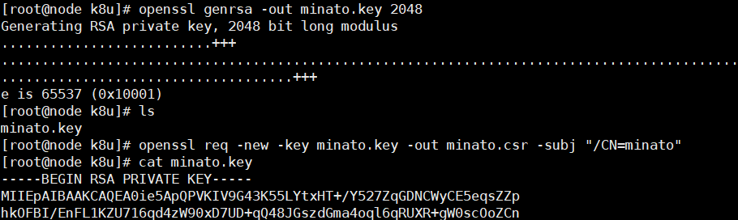
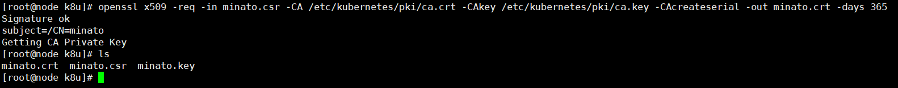
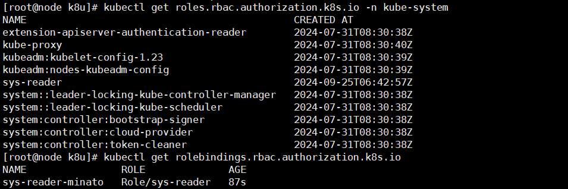
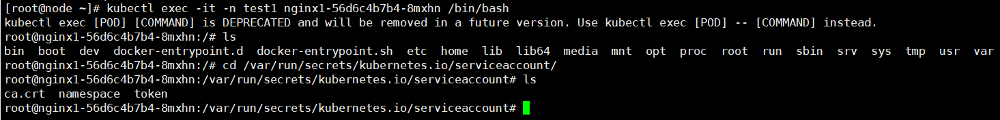

# RBAC 

**Role-Based Access Control 基于角色的访问控制**

在K8s版本大于1.6后默认启用。

apiserver启动参数：`--authorization-mode=RBAC`

查看开启状态：

```bash
cat /etc/kubernetes/manifests/kube-apiserver.yaml | grep -C3 'authorization-mode'

kubectl get po -n kube-system kube-apiserver-xxx -o yaml
```

authentication 认证

authorization 授权

## Authentication 认证的方式

- HTTP Token

    发送请求时在请求头部加入token。

    `--token-auth-file=xxx`

- HTTP Base

    传统的账号密码，用Base64加密

    `--basic-auth-file=xxx`

- HTTP CA

    x509客户端证书。

    `--client-ca-file=xxx`

## Authorization 授权的策略

- Always Deny
- Always Allow（默认）
- ABAC（Attribute-Based）

    基于属性的访问控制

- Webhook

    HTTP回调模式，动态准入控制

- RBAC
- Node专用模式

    节点授权专门对kubelet发出的请求进行访问控制s

## RBAC APIs

有四种：

- Role
- ClusterRole
- RoleBinding
- ClusterRoleBinding

**一个角色 包含 一组相关权限的规则，且只能累加权限。**

    可用Role定义到某个namespace上或者使用ClusterRole定义到整个集群

    一个Role只能对一个特定ns中的资源赋予访问权限。

### *Role示例*

```yaml
apiVersion: rbac.authorization.k8s.io/v1
kind: Role #ClusterRole
metadata:
  name: pod-read-role
  namespace: test1 #如果是ClusterRole，则ns忽略
rules:
  - apiGroups: [""] #指定核心api组
    resources: ["pods"]
    verbs: ["get","watch","list"]
```

### *RoleBinding示例*

将Role中定义的权限赋予：
- 一个用户 user
- 一组用户 groups
- Service Account

```yaml
apiVersion: rbac.authorization.k8s.io/v1
kind: RoleBinding #ClusterRoleBinding
metadata:
  name: pod-read-user
  namespace: test1
subjects:
  - kind: User
    name: Minato #大小写敏感
    apiGroup: rbac.authorization.k8s.io
roleRef:
  kind: Role
  name: pod-read-role
  apiGroup: rbac.authorization.k8s.io
```

创建Binding后，不能修改Binding所引用的Role或ClusterRole。

如果需要改变roleRef，应删除Binding对象，重新创建。

## Referring to resources 资源引用

比如请求头：

`GET /api/v1/namespace/{namespace}/pods/{name}/log`

pod区分ns，log是pod的子资源。

允许一个主体同时访问pod和pod logs需要这么修改：

```YAML
  resources: ["pods","pods/log"]
```

对于某些请求，也可以用resourceNames按名称引用资源。

```YAML
  resources: ["configmaps"]
  resourceNames: ["my-configmap"]
```

*若verb为create，则resourceName不生效，因为资源还未创建。*


# K8s用户

分为两种：
- **Service Account** 由K8s管理
- **User** 由外部管理

所有对K8s访问的请求都需要绑定身份信息，*但是K8s本身不保存用户列表。*

## Service Account 与 User 区别

- User通常是人来使用，ServiceAccount是某个服务/资源/程序使用

- User可以作用到全局且需要唯一，ServiceAccount是K8s内部资源，在不同的ns会被认为是不同的资源

**用户**其实可以直接理解为**K8s的使用者。**

添加用户的说法也不准确，因为用户（Role）早已存在。

**这里所做的只是使K8S能够认知此用户，并且控制此用户在集群内的权限。**

用户认证方式就是上述三种。

## 客户端证书（x509）认证

假如需要操作的用户名为minato

### 为用户生成证书

- 首先为用户创建私钥：

```bash
openssl genrsa -out minato.key 2048
```

- 接着用此私钥创建一个csr（证书签名请求），其中需要在subject里带上用户信息

```bash
openssl req -new -key minato.key -out minato.csr -subj "/CN=minato"
```



- 找到apiserver的CA证书

**K8s证书ca.crt获取方式**

```bash
cat /etc/kubernetes/pki/ca.crt #CA证书

cat /etc/kubernetes/pki/ca.key #CA私钥

kubectl get cm -n kube-system kube-root-ca.crt -o yaml
```

- 通过apiserver的CA和刚创的csr，为用户颁发证书

```bash
openssl x509 -req -in minato.csr -CA /etc/kubernetes/pki/ca.crt -CAkey /etc/kubernetes/pki/ca.key -CAcreateserial -out minato.crt -days 365
```



注意保存生成的crt和原本的key。

### 利用RBAC绑定Role

Role: sys-reader.yaml

```yaml
apiVersion: rbac.authorization.k8s.io/v1
kind: Role
metadata:
  namespace: kube-system
  name: sys-reader
rules:
  - apiGroups: [ "" ] # 指定核心API组
    resources: [ "*" ] # 核心API组下的所有资源
    verbs: [get, watch, list]
```

RoleBinding: bind-sys-reader.yaml

```yaml
apiVersion: rbac.authorization.k8s.io/v1
kind: RoleBinding
metadata:
  name: sys-reader-minato
  namespace: kube-system
subjects:
  - kind: User
    name: minato
    apiGroup: rbac.authorization.k8s.io
roleRef:
  kind: Role
  name: sys-reader
  apiGroup: rbac.authorization.k8s.io
```



### 为kubectl配置用户

配置文件地址：`~/.kube/config`

**集群名称也在这里：(用kubeadm创建集群时指定)**

```yaml
apiVersion: v1
clusters:
- cluster:
    certificate-authority-data: ...
    server: https://master:6443
  name: kubernetes
```

*找到集群名称别的方式：*

```bash
kubectl get cm -n kube-system kubeadm-config -oyaml | grep clusterName
```

<br>

将验证信息加入kubectl的配置，添加一个名为minato的用户

```bash
kubectl config set-credentials minato --client-certificate=path/to/minato.crt --client-key=path/to/minato.key
```

添加一个context配置：

```bash
kubectl config set-context minato@kubernetes --cluster=kubernetes --namespace=kube-system --user=minato
```

使用这个上下文（使用这个用户）操作K8s：

```bash
kubectl --context=minato@kubernetes get po 
```

**不用加`-n`选项，因为Role中已经指定此用户可以访问的命名空间。**

或者直接激活此上下文：

**默认激活的上下文是`kubernetes-admin@kubernetes`**

```bash
kubectl config use-context minato@kubernetes
```

### Tips: 将认证信息嵌入kubectl的配置中

通过kubectl config set-credentials命令添加的用户，其默认使用的是引用证书文件路径的方式，表现在`~/.kube/config`中，就是：

```yaml
contexts:
- context:
    cluster: kubernetes
    namespace: kube-system
    user: minato
  name: minato@kubernetes

users:
- name: minato
  user:
    client-certificate: path/to/minato.crt
    client-key: path/to/minato.key
```

### 使用kubectl查看所有的api:

```bash
kubectl api-resources
```

API 组通常由两部分组成：组名和版本号。

apiVersion: apps/v1 中的 apps 是组名，v1 是版本号。

***核心组没有组名。***

## RBAC verbs

|verb|说明|
|--|--|
|get|能查看单个资源的详细信息|
|list|只能列出所有资源|
|watch|监视资源变化|
|create|创建资源|
|update|更新资源|
|patch|部分更新资源|
|delete|删除资源|
|deletecollection|删除资源集合|

## 在HTTP请求中使用RBAC获取资源


********

# Service Account - SA

ServiceAccount是给运行在Pod中的程序使用的身份认证

**Pod容器的进程需要访问API Server时用的就是ServiceAccount账户**

*ServiceAccount仅局限它所在的namespace*，每个namespace创建时都会自动创建一个default service account和与之对应的Secret

创建Pod时，如果没有指定Service Account，Pod则会使用default Service Account。

*未指定sa：*

```yaml
[root@node ~]# kubectl get po -n test1 nginx1-... -o yaml

apiVersion: v1
Kind: Pod
metadata: ...
spec: 
  ...
  volumeMounts:
  - mountPath: /var/run/secrets/kubernetes.io/serviceaccount
    name: kube-api-access-nwt9c
    readOnly: true
  ...
  serviceAccountName: default
  ...
  volumes:
  - name: kube-api-access-nwt9c
    projected:
      defaultMode: 420
      sources:
      - serviceAccountToken:
          expirationSeconds: 3607
          path: token
  ...
```

自动使用默认的sa。

```bash
[root@node ~]# kubectl get secrets -n test1 
NAME                  TYPE                                  DATA   AGE
default-token-q58d9   kubernetes.io/service-account-token   3      45d
```

进入Pod查看sa：

```bash
kubectl exec -it -n <ns> <pod> /bin/bash`
```


## 自定义SA

sa.yaml

```yaml
apiVersion: v1
kind: ServiceAccount
metadata:
  namespace: test1
  name: sa-test1
```
或者
```bash
kubectl create sa <name> -n <ns>
```

