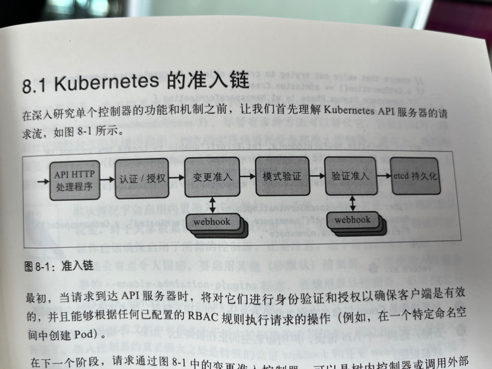
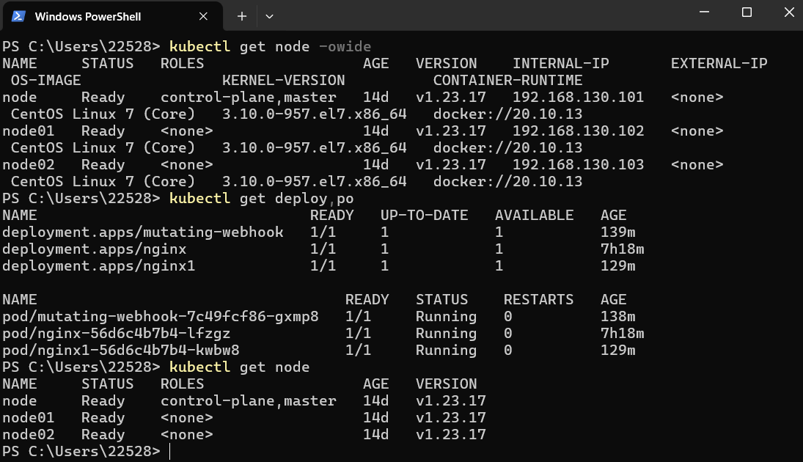
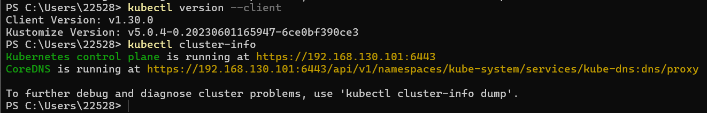
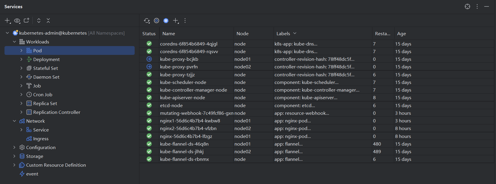

# 动态准入控制

https://kubernetes.io/zh-cn/docs/reference/access-authn-authz/extensible-admission-controllers/

## 准入控制链

## 准入Webhook

准入Webhook是一种用于接收准入请求并对其进行处理的HTTP回调机制。

可以定义两种类型的Webhook：

- MutatingAdmissionWebhook 变更准入

    *类似于SpringAOP的拦截请求添加通知。*

- ValidatingAdmissionWebhook 验证准入

    与变更准入不同，这个Webhook无法修改对象。
    
    此准入控制器调用与请求匹配的所有验证性 Webhook。 匹配的 Webhook 将被并行调用。如果其中任何一个拒绝请求，则整个请求将失败。

## K8s本地调试

### Windows Powershell

配置步骤：

- 在k8s.io下载kubectl.exe
- 将kubectl.exe放在一个记得住的文件夹，将这个文件夹的路径加入path环境变量
- 进入master节点，找到~/.kube/config文件
- 把这个config文件拿出来，在Windows用户目录下创建/.kube文件夹，放进去

- 运行 `kubectl version --client`，若是能输出版本号即安装成功
- 运行 `kubectl cluster-info`，若是返回一个url，则访问集群成功

### JetBrains Kubernetes Plugin

在Goland中使用的插件，可以本地一键部署，一键删除。

步骤：

- 安装插件
- Settings-->Build-->Kubernetes
- 配置Path to kubectl executable

    *kubectl.exe的位置*

- 配置Configuration，设置Scope为Global，勾选自动更新

    */.kube/config的位置*

- Service-->"+"-->Kubernetes-->Add Contexts-->From Default Directory

