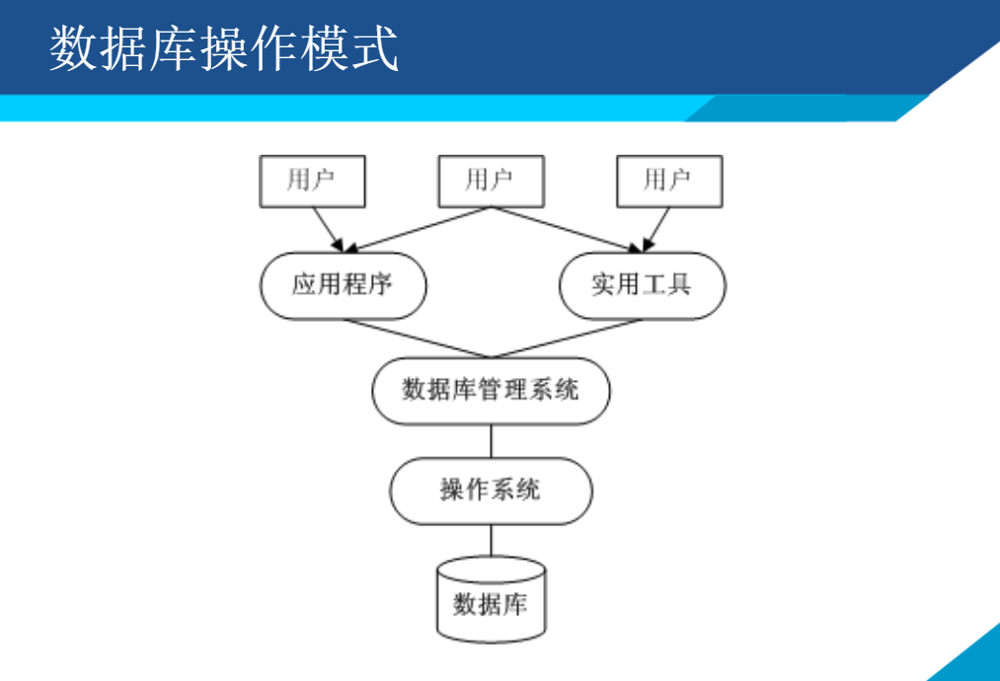

# 数据库 Database

是存放数据的仓库。

按一定格式**永久存储**在计算机存储设备上。

是有组织的，可共享的大量数据的集合。

## 1.数据库管理系统 DBMS

**Database Management System**

是一个专门用于实现对数据进行管理维护的**系统软件。**

## 2.数据库系统

一般由：
- 数据库 DB
- 数据库管理系统及其实用工具 DBMS
- 应用程序 APP
- 数据库管理员 administrator

组成。

操作模式：

## 3.DB管理data的优点

- 相互关联的数据集合
- 较少的数据冗余
- 程序与数据相互独立
- 保证数据的安全可靠
- 最大程度保证数据的正确性
- 数据可以并发使用

## 4.数据模型

对现实世界数据特征的抽象。

实际上是 模型化 数据和信息 的工具。

根据模型应用目的不同，分为：
- 概念层数据模型

    从数据的语义视角来抽取模型，一般用于设计阶段
    与数据库如何实现无关。

- 组织层数据模型

    从数据的组织方式来描述数据。主要有：
    层次模型、网状模型、关系模型、对象-关系模型
    与使用的DBMS有关。

### 实体 - 联系模型  Entity-Relationship Model

使用工具： **E-R图**

主要元素：**实体、属性、联系**

## 5.关系型数据库

**关系数据模型 三要素** 
- 数据结构

    关系型数据库就是 表 或 关系的集合
    数据表是逻辑结构，而不是物理结构。

- 操作集合

    传统关系运算：
    交、并、差、广义笛卡尔乘积
    专门关系运算：
    选择(Select) 投影(Project) 
    连接(Join) 除(Division)
    有关的数据操作：
    增、改、查、删 - CURD

- 完整性约束

    实体完整性 参照完整性 用户定义的完整性

**实体完整性**

指关系数据库中所有的表都**必须有主键**

而且表中不允许存在：
- 无主键值的记录
- 主键值相同的记录

**参照完整性**

也称为引用完整性。 一般指多个实体或关系之间的关联关系。

**外键 Foreign Key**

设F是关系R的 一个或一组属性，如果：

F与关系S的主键相对应；

则称F是关系R的外键，并称关系R为参照关系，关系S为被参照关系。

