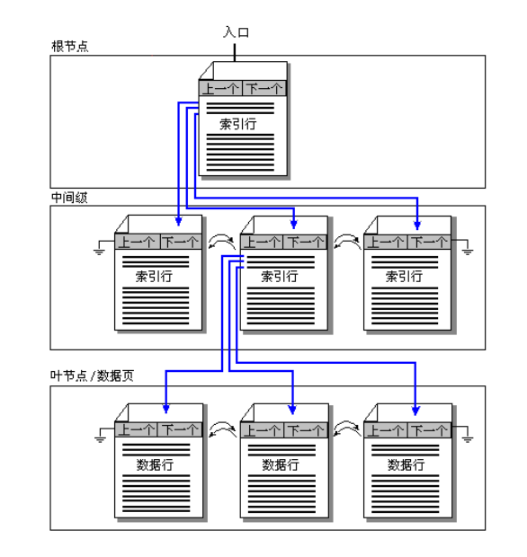
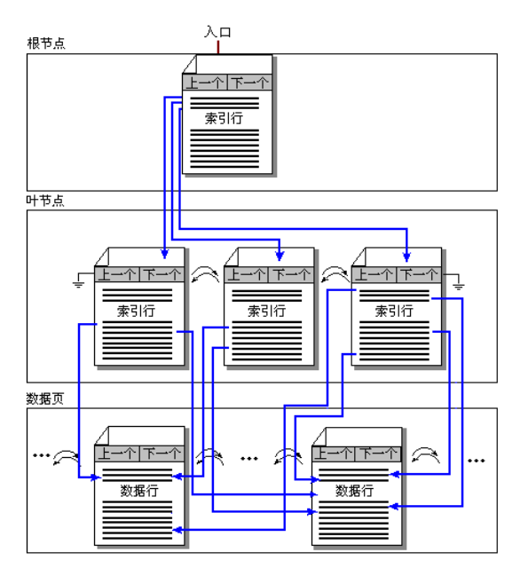
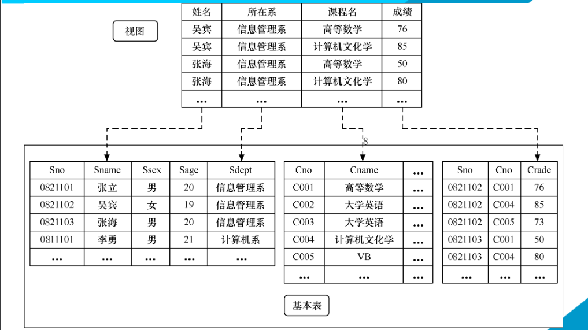

# 索引 & 视图  -  Index & View

## 索引 Index

*类似于书中的目录。*

**通过存储指向数据行的指针，可以快速定位和访问表中的数据。**

索引使对数据的查找不需要对整个表进行扫描，就可以在其中找到所需数据。

可以为表中的单个列建立索引，也可以为一组列（索引项）建立索引。

*索引一般采用B树结构。*

### 1.索引的存储结构及分类

- 聚簇索引 Clustered Index

    将数据按照索引项的顺序进行物理排序。

- 非聚簇索引 Non-clustered Index

    不对数据进行物理排序。

**共同点**
- 都使用B树结构来存储索引项
- 都包含数据页和索引页
- 索引页用来存放索引项和指向下一层的指针
- 数据页用来存放数据

### 2.聚簇索引 - Clustered Index

聚簇索引的B树自下而上建立，最下层叶结点存放数据，它同时也是数据页。

多个数据页生成一个中间层结点的索引页，然后再由数个中间层的结点的索引页合成更上层的索引页。

如此上推，直到生成顶层根节点索引页。

由于在此类索引中，数据按照索引项的顺序进行物理排序，因此聚簇索引很类似于电话簿。

一个表只能包含一个聚簇索引，但一个索引可以由多个列组成。

*遇到下列情况可以考虑创建聚簇索引：*
- 包含大量非重复值的列
- 使用如下运算符返回一个范围值的查询：

    between..and > >= < <=

- 经常被用作内外连接的列
- order by或group by子句中指定的列

### 3.非聚簇索引 Non-clustered Index

有点类似于书尾附录的术语表。

数据不按照术语表的顺序存放，但是术语表中的每个词都有确切的位置。

**与聚簇索引不同，**
- 叶结点不是存放数据的数据页
- 叶级结点是索引行。每个索引行包含非聚簇索引关键字值以及一个或多个行定位器，这些行定位器指向该关键字值对应的数据行。

    如果索引不唯一，则可能是多行

*遇到下列情况可以考虑创建非聚簇索引：*
- 包含大量非重复值的列
- 经常作为查询条件使用的列
- 经常作为连接和分组条件的列

### 唯一索引

- 确保索引列不包含重复值。
- 在组合唯一索引的情况下，可以确保列中每个值的组合都是唯一的
- 上述两种索引都可以是唯一的

**说明事项**

如果必须要实施唯一性来确保数据的完整性

则应该在列上使用UNIQUE约束或Primary key约束。

实际上，当创建PK约束或UNIQUE约束时，系统会自动在这些列上创建唯一索引。

### 4.创建索引

语法：

    create [unique][clustered|nonclustered] index 索引名
        on 表名(列名[,...n])

说明：
- unique 创建唯一索引
- clustered 创建聚簇索引
- nonclustered 创建非聚簇索引(默认)

例如：为Student表的Sname列创建非聚簇索引

    create index Sname_index on Student(Sname)

### 5.删除索引

语法：
 
    drop index <表名>.<索引名>

例如：删除Student表的Sname索引

    drop index Student.Sname_index

 

## 视图 View

*视图是从数据库的基本表中选出来的数据组成的逻辑窗口*

**是基本表的部分行和列数据的组合，是一个虚表**

DB只存储视图的定义，而不存储视图所包含的数据。

### 1.定义视图

语法:

    create view <视图名>[(视图列名表)] as 查询语句

其中，*查询语句中通常不包含order by、distinct子句。*

在定义视图时要么指定视图的全部列名，要么全部省略不写。

如果省略了“列明表”，则视图的列名与查询语句返回的列名一致。

**如下三种情况必须指定视图列名：**
- 某个目标列使用了聚合函数或者表达式，且没有起别名
- 多表连接时选出了几个同名列作为视图的字段
- 需要在视图中为列选用新的更合适的列名

#### 定义单源表视图

视图取自一个基本表的部分行、列，视图行列与基本表行列对应

*一般可读，可修改*

例如：

    --建立查询信息管理系学生的学号、姓名、性别和年龄的视图
    create view IS_Student as 
        select Sno, Sname, Ssex, Sage from Student
            where Sdept = '信息管理系'

#### 定义多源表视图

子源表多于一个，*一般只可读。*

例如：

    --建立信管系选修了C001号课程的学生学号、姓名和成绩的视图
    create view V_IS_S1(Sno, Sname, Grade) as
        select Student.Sno, Sname, Sage from Student, SC
            where Sdept = '信息管理系'
            and Student.Sno = SC.Sno
            and SC.Sno = 'C001'

#### 在原有视图上定义新视图

视图的数据源可以来自其他视图。

例如：

    create view IS_Student_Sage as
        select Sno, Sname, Sage from IS_Student
            where Sage < 20

#### 定义带表达式的视图

定义基本表时，为减少数据冗余，表中只存放基本数据。

由基本数据经过各种计算派生出的数据一般不存储。

由于视图中的数据并不实际存储，因此**可以在视图中设置一些附加列来保存这些派生的数据。**这些列称为*虚拟列。*

称包含虚拟列的视图为*带表达式的视图*。

例如：

    --定义一个查询学生出生年份的视图
    --内容包括学号，姓名和出生年份
    create view BT_S(Sno, Sname, Sbirth) as
        select Sno, Sname, 2020-Sage [Sbirth] from Student

#### 含分组统计信息的视图

子查询中含group by子句，视图行列由基本表行列得到。

*只可读。*

例如：

    -- 定义一个查询每个学生的学号及平均成绩的视图
    create view S_G as
        select Sno, avg(Grade) 平均成绩 from SC
            group by Sno

### 2.通过视图查询数据

查询操作与基本表查询一致。

### 3.通过视图修改数据

并不是所有视图都可以用于修改数据，如经过统计或表达式计算得到的视图。

能否通过视图修改数据的基本原则：
- 这个操作能够最终落实到基本表中，并成为对基本表的正确操作。

### 4.修改和删除视图

**修改视图 - alter**

语法：

    alter view <视图名> [(<列名>[,...n])] as select语句

例如：

    alter view S_G(Sno, 平均成绩, Count_Cno) as
        select Sno, avg(Grade), count(*) from SC
            group by Sno

**删除视图 - drop**

语法：

    drop view <视图名>

### 5.视图的作用

- 简化数据查询语句
- 使用户能从多角度看待同一数据
- 提高了数据的安全性
- 提供了一定程度的逻辑独立性

