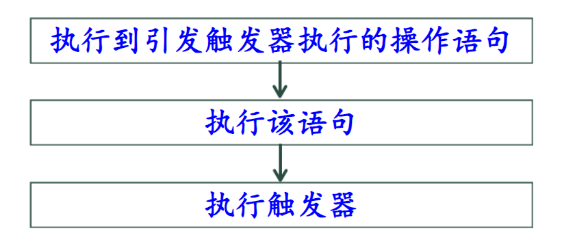
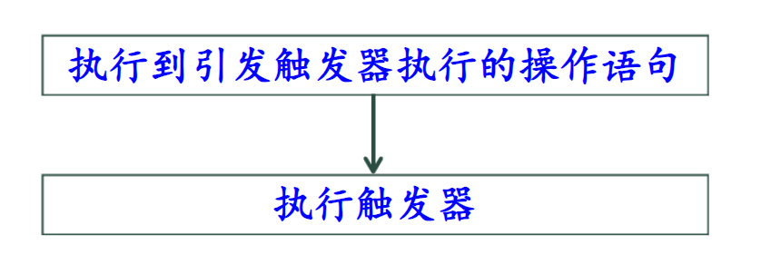

# 触发器 Trigger & 存储过程 Procedure

触发器是一段 由 对数据的更改操作 引发的 自动执行的 代码。

更改操作包括：
- update
- insert
- delete

触发器通常用于保证业务规则和数据完整性。

主要优点是用户可以用编程的方法实现复杂的处理逻辑和商业规则，增加了数据完整性约束的功能。

## 1. 创建触发器

语法：

    create trigger 触发器名称 on {表名|视图名}
    {for|after|instead of}{[insert][,][delete][,][update]}
    as
        SQL语句

**注意事项**
- 在一个表上可以建立多个名称不同、类型各异的触发器，每个触发器可由所有三个操作引发
- 对于*after型触发器*，可以在同一种操作上建立多个触发器
- 对于*instead of型*触发器，同一操作上只能建立一个触发器
- 大部分SQL语句都可以在触发器中实现

    除了创建、更改数据库的语句和所有的drop语句。

**两个特殊的临时表 - INSERTED DELETED**

由系统自动创建，结构与建立触发器的表结构相同

*只能用在触发器代码中。*

- INSERTED 保存Insert操作中新插入的数据 和 update后的数据
- DELETED 保存delete删除的数据 和 update前的数据

### 1.1 后触发型触发器 - after型触发器

当此型触发器执行时，引发触发器执行的数据操作语句已经执行完毕。

例如：

    -- 创建后触发型触发器。限制每个学生总选课门数不超过5
    create trigger tri_total_After on SC after insert
        as
            if(select count(*) from SC where Sno in(
                select Sno from INSERTED
            )) > 5
        rollback;

### 1.2前触发型触发器 - instead of型触发器

指定执行触发器 而不是 执行 引发触发器执行的SQL语句，从而替代引发语句的操作。

例如：

    -- 限制每个学生总的选课门数不超过7
    create trigger tri_total_instead on SC instead of insert
    as
        if(select count(*) from SC where Sno in(
            select Sno from INSERTED 
        )) < 7
        insert into SC select * from INSERTED;

### 删除触发器 

语法：

    drop trigger <触发器名>

## 2. 存储过程

使用SQL语言编写访问DB的代码时，可用两种方法存储和执行这些代码：

- 在C端存储代码，并创建向数据库服务器发送的SQL命令
- 将SQL语句存储在数据库服务器端，然后由APP调用执行这些SQL语句

存储在数据库服务器端供客户端调用执行的SQL语句就是存储过程。

### 功能
- 接受输入参数并以输出参数的形式将多个值返回给调用者
- 包含执行数据库操作的语句
- 将查询语句执行结果返回到C端内存中

### 优点
- 允许模块化程序设计

    相当于PreparedStatement的预编译。

- 改善性能 
    
    相当于添加缓存。

- 减少网络流量

    只需要一条执行存储过程的代码即可实现，相当于调接口。

- 可作为安全机制使用

    对于即使没有直接执行procedure权限的用户，
    也可以授予他们执行该存储过程的权限。

### 创建和执行存储过程

**创建**

    create proc[edure] 存储过程名 
    [{@参数名 数据类型} [=default][output]][,...n]
    as 
        SQL语句[,...n]

其中，**output代表将统计结果用输出参数返回**

**执行**

    [exec[ute]] 存储过程名 [实参[, output][,...n]]

例如：（--无参存储过程）

    --查询计算机系学生的考试情况，列出学生的姓名、课程名、成绩
    create procedure p_StudentGrade1 as
        select Sname, Cname, Grade from Student s
        inner join SC on s.Sno = SC.Sno 
        inner join Course c on c.Cno = SC.Cno
        where Sdept = '计算机系'
    执行：
    exec p_StudentGrade1

例如：（--有参存储过程）

    --查询某个指定系学生的考试情况
    --列出学生姓名、所在系、课程名和成绩
    create procedure p_StudentGrade2 @dept char(20) as
        select Sname, Sdept, Cname, Grade from Student s
        inner join SC on s.Sno = SC.Sno
        inner join Course c on c.Cno = SC.Cno
        where Sdept = @dept
    执行存储过程，查询信管系学生的成绩信息
    exec p_StudentGrade2 '信息管理系'

参数传递方式：
- 按位置
- 按指定参数名

