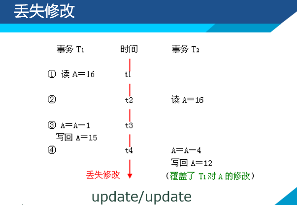
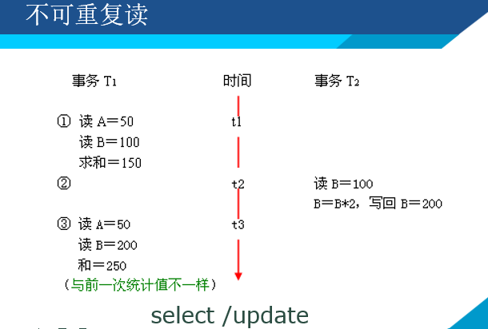
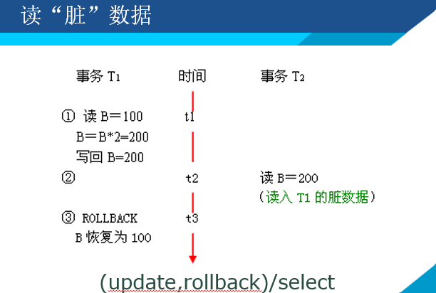

# 数据库事务与并发控制

## 1. 事务

### 1.1 事务的概念

事务是用户定义的一系列数据操作的集合，这些操作组合起来作为一个完整的工作单元。

**一个事务内的所有语句要么全部执行，要么全部不执行。**

例如：*银行转账，对两方修改存款的操作*

### 1.2* 事务的特性 - ACID

- **原子性 Atomicity - 基础**

    事务是DB的逻辑工作单位，事务中的操作要么都做，要么都不做。

- **一致性 Consistency - 目的**

    事务必须使DB从一个一致性状态转移到另一个一致性状态中。

- **隔离性 Isolation - 手段**

    一个事务的执行不能被其他事务干扰。

- **持久性 Durability - 结果**

    事务一旦提交，对数据库中数据的改变就是永久的。

事务使DB并发控制和恢复的基本单位。

保证事务的ACID特性是事务处理的重要任务。

### 1.3 事务处理模型

- 隐式事务

    每一条数据操作语句都自动地成为一个事务。

- 显示事务

    有显式的开始和结束标记的事务。

**T-SQL事务处理模型 - 显式事务**

开始标记：

    begin transaction | tran

结束标记

    commit [transaction | tran]
    rollback [transaction | tran] 

事务示例（SSMS）：

    begin try --开始捕捉异常
        begin transaction tr --开始名为tr的事务
            update SC set Grade = Grade + 1 where Cno='C002'
            update SC set Grade = Grade + 1 where Cno='C001'
        commit transaction tr --提交名为tr的事务
    end try --结束捕捉异常
    begin catch --有异常被捕获
        rollback tran tr --回滚事务
    end catch --结束异常处理

**MySQL - InnoDB引擎才支持事务。**

MySQL中事务控制命令：

    begin 或 start transaction --显式地开启事务 貌似不能起名
    commit 或 commit work --提交事务
    rollback 或 rollback work --回滚事务，并撤销未提交的更改
    savepoint s1 --创建回滚点，一个事务中可以有多个
    rollback to [savepoint] s1 --把事务回滚到标记点

### 1.4 事务日志

DBMS对DB所做的每个更改操作都维护一个事务记录，并保存到日志中。

DBMS用事务日志来跟踪所有影响数据库值得操作，以使DBMS能够从由事务引起的失败中回复DB。

 

## 2. 并发控制

在多用户系统中，可能同时运行多个事务。

当多个事务同时运行时，特别是当这些事务是对同一段数据进行操作时，彼此之间就可能产生**相互干扰**的情况。

如：*订票 银行*

### 2.1.1 不同的多事务执行方式

- **串行执行 - Serializable**

    每个时刻只能有一个事务运行。
    不能充分利用系统资源，不能发挥DB共享资源的特点。

- **交叉并行执行**

    相当于cpu的按时间片分配运行，微观上还是串行。

- **同时并发执行**

    多处理机时，真正可以同时运行多个事务。

### 2.1.2 并发事务可能产生的问题

事务并发执行带来的问题：

*会产生多个事务同时存取同一数据的情况。*

**可能会存取和存储不正确的数据，破坏事务一致性和DB一致性。**

*并发控制是衡量DBMS性能的重要指标。*

并发操作带来的数据不一致性情况大致分为4种：

- **丢失修改 - update(1)/update(2)**

- **不可重复读 - select(1)/update(2)**

- **读“脏”数据 - select(1)/(update|rollback)(2)**

- **产生“幽灵”数据 - select(1)/(insert|delete)(2)**

    属于不可重复读的范畴。

    事务一：按一定条件读取数据，得到一个记录集合
    事务二：删除或插入了一些数据
    事务一：再次以同样的条件读取数据，发现少了或多了一些记录

    这些少了的或多了的记录对于事务一来说就是“幽灵”数据。

### 2.2 可交换的活动

活动 - 原子操作

若两个活动在交换前后执行的结果相同，则为可交换的活动。

**对于读和写：**

- 读-读：可交换
- 读-写：不可交换（读的结果不同）
- 写-写：不可交换（第二个写总是会使第一个写失效）

## 3. MySQL InnoDB事务隔离级别

MySQL隔离级别有4种：

- **read uncommitted**
    
    读取尚未提交，不解决读脏数据。

- **read committed**

    读取已提交，解决脏读。

- **repeatable read - default**

    重读读取，可以解决 脏读 和 不可重复读

- **serializable**

    串行化，可以解决 脏读 不可重复读 读幽灵 相当于锁表

查询全局事务隔离级别(MySQL80+)：

    show global variables like '%isolation'

    select @@global.transaction_isolation;

查询当前会话隔离级别(MySQL80+)：

    select @@transaction_isolation;
