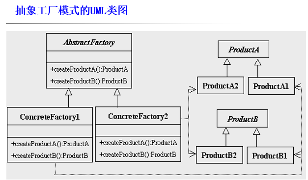
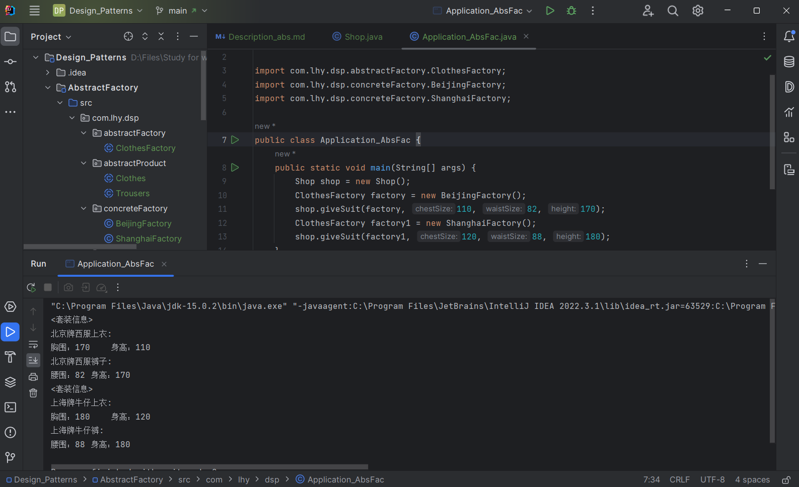

# 抽象工厂模式 Abstract Factory

在工厂模式中，一种具体的工厂对应一种具体的产品。

但有时我们需要 *一个工厂可以提供多个产品对象，而不是单一的产品对象。*

## 产品等级结构 & 产品族

**等级结构：**电视机->具体品牌电视机

**产品族：**

在抽象工厂中，指*同一个工厂生产的*，*位于不同产品等级结构的*一组产品

海尔公司 -> 海尔电视机、海尔电冰箱

## 意图

提供一个创建**一系列相关或相互依赖对象的接口**，而无需指定它们具体的类。

## 主要解决

接口选择问题。

## 何时使用

系统的产品有多于一个的产品族，而系统只消费其中某一族的产品。

- 系统需要为用户提供多个对象，但*不希望用户直接使用new运算符实例化这些对象*，即希望用户和创建对象的类解耦。
- 系统需要为用户提供多个相关的对象，以便用户联合使用它们，但*又不希望用户来决定这些对象是如何关联的。*
- 系统需要为用户提供一系列对象，但只需要用户知道这些对象有哪些方法可用，*不需要用户知道这些对象的创建过程。*

## 设计关键

- 在一个产品族中定义多个产品；
- 在一个工厂里聚合多个同类产品。

即：在一个抽象类或接口中定义若干个*抽象方法*，这些抽象方法分别返回某个类的实例。

    抽象方法数 = 产品等级结构树
    具体工厂数 = 产品族数

## 核心角色

抽象工厂模式包含以下关键角色：

- 抽象产品 Abstract Product

    抽象类或接口，负责定义具体产品必须实现的方法。

- 具体产品 Concrete Product

    一个子类或实现接口的类。

- 抽象工厂 Abstract Factory

    负责定义若干个抽象方法。

- 具体工厂

    重写抽象工厂中的方法，返回具体产品的实例。

## UML类图

## 代码实例

https://github.com/Uchiha-Minato/Study-Java/tree/main/Design_Patterns/AbstractFactory

## 具体应用实例

**1.Java SE AWT 抽象窗口工具包**

它使用抽象工厂模式来实现在不同的操作系统中应用程序呈现与所在操作系统一致的外观界面。 

**2.软件中更换界面主题时**

## 优点 & 缺点

**优点**

- 使用户和创建的对象解耦
- 可以方便的为用户配置一系列对象
- 可以随时增加“具体工厂”为用户提供一组相关的对象

**缺点**

- 不太容易扩展新的产品。

    如果需要给整个产品族添加一个新产品，则需要修改抽象工厂，会导致修改所有的工厂实现类。
