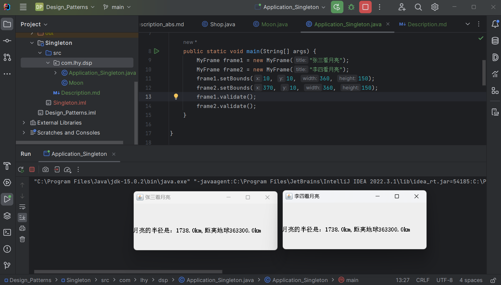

# 单例模式 Singleton

最简单的设计模式。

这种模式涉及到一个单一的类，该类负责创建自己的对象，并保证只有一个实例被创建。

并且，这个类提供一个访问其唯一对象的方法。

**单例模式是一种创建型设计模式，它确保一个类只有一个实例，并提供了一个全局访问点来访问该实例。**

## 意图

保证一个类仅有一个实例，并提供一个访问它的全局访问点。

## 主要解决

- 全局使用的类频繁地创建与销毁。

## 何时使用

- 当系统需要某一个类只能有一个实例时；
- 想要控制实例数量，节省内存资源时。

## 设计关键

- 私有的构造函数；
- 提供一个返回唯一实例的static方法；
- 判断系统是否已有这个单例，有则访问，没有则创建。

## 核心角色

只有一个 - **单例类**

## 实现方式

**1.饿汉式**

在JVM加载此单例类时就实例化，提前占用系统资源。

**2.懒汉式**

第一次被引用时才实例化。

## 代码实例

https://github.com/Uchiha-Minato/Study-Java/tree/main/Design_Patterns/Singleton

## 具体应用实例

- 身份证号码唯一
- 操作系统中的唯一打印池

## 优点 & 缺点

**优点**

- 单例类的唯一实例由单例类本身控制

    因此可以很好地控制用户何时访问它。

**缺点**

- 由于单例模式没有抽象层，因此单例类扩展很困难;
- 单例类的职责过重，一定程度上违背了单一职责原则;
- 滥用单例将带来一些负面问题。

    如为了节省资源将数据库连接池对象设计为单例类
    可能会导致共享连接池对象的程序过多而出现连接池溢出。

