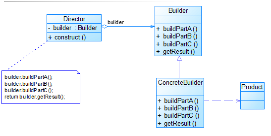
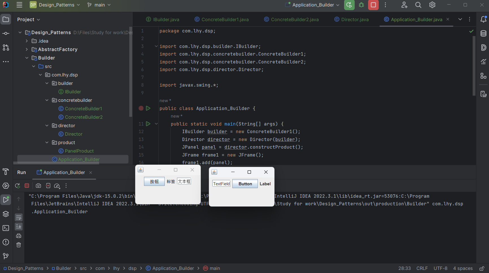

# 建造者模式 Builder

建造者模式使用多个简单的对象一步步构建成一个复杂的对象。

这些简单的对象就相当于一个机器中的各个零件。

## 意图

将一个复杂的构建与其表示相分离，使得同样的构建过程可以创建不同的表示。

建造者返还给客户的是一个已经建造完毕的完整产品对象。

用户无需关心该对象所包含的属性以及它们的组装方式。

## 主要解决

在软件系统中，有时面临着"一个复杂对象"的创建，其其通常由各个部分的子对象用一定的算法构成；

由于需求的变化，这个复杂对象的各个部分经常面临着剧烈的变化，但是将它们组合在一起的算法却相对稳定。

## 何时使用

零件不变，组合算法经常变化的时候

## 设计关键

- 建造者创建和提供产品实例

- 指挥者管理建造出来的实例

- 将一个包含有多个组件对象的创建分为若干个步骤，并将这些步骤封装在一个称作生成器的接口中。

## 核心角色

- 产品 Product

    具体建造者要构造的复杂对象。

- 抽象建造者 Abstract Builder

    一个接口，除了 为创建一个Product对象的各个组件定义了若干方法之外，
    还要定义返回Product对象的方法。

- 具体建造者 ConcreteBuilder

    实现抽象建造者接口的类。

- 指挥者 Director

    含有Builder接口声明的变量，负责向用户提供具体的建造者。
    用它来控制产品的创建过程，也用它来隔离用户与创建过程的关联。

## UML类图

## 代码实例

https://github.com/Uchiha-Minato/Study-Java/tree/main/Design_Patterns/Builder

 

## 具体应用实例

**1.Android系统弹窗 - AlertDialog**

这是简化版的建造者模式，省略了抽象建造者和指挥者。

Android API 29 - Android 10 文档：

    package android.app
    public class AlertDialog ... {
        ...
        public static class Builder {
            ...
            public Builder(Context context) {
                this(context, resoleDialogTheme(...));
            }
            public Builder setTitle(CharSequence title){...}
            public Builder setMessage(CharSequence message){...}
            public Builder setIcon(@DrawableRes int iconId){...}
            public Builder setPositiveButton(CharSequence text, final OnClickListener listener){...}
            ...
            public AlertDialog create() {...}
            public AlertDialog show() {
                final AlertDialog dialog = create();
                dialog.show();
                return dialog;
            }
        }
    }

其中，
- AlertDialog是产品；

- 内部类Builder是具体建造者，同时也是指挥者。

    类中的许多set方法返回的是AlertDialog的零件；
    show()方法返回了AlertDialog的实例，同时将AlertDialog显示。

**2. java.lang.StringBuilder**

**3. 各大餐馆的各种套餐。**

## 优缺点

**优点：**

- 将对象的构造过程封装，并把对象的构造过程从创建对象的类中分离
- 可以有效地控制对象的构造过程
- 满足 开-闭原则

**缺点：**

- 如果产品之间差异较大，则不适合使用这个模式
- 如果产品内部变化复杂，可能会导致需要定义很多具体建造者，导致系统变得很庞大。