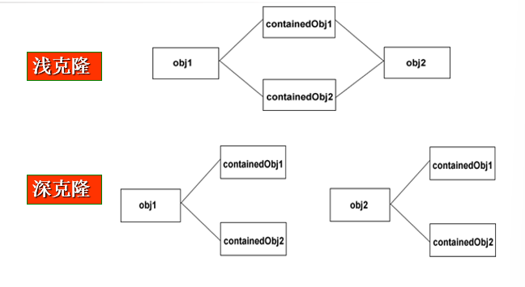
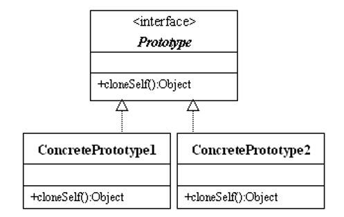
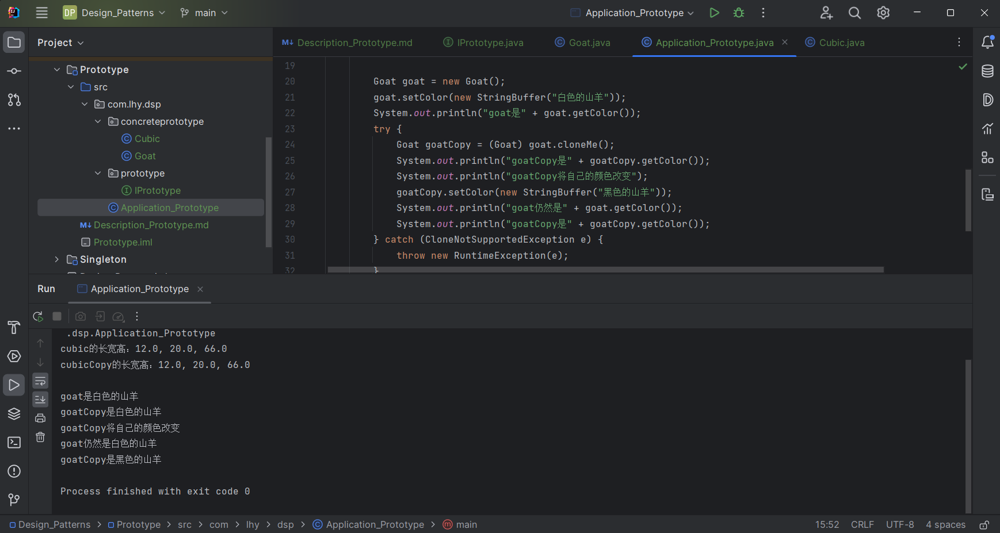

# 原型模式 Prototype

用原型实例指定创建对象的类型，并且通过复制这个原型创建新的更多同类型的对象。

相当于影分身。

## 意图

用原型实例指定创建对象的种类，并且通过拷贝这些原型创建新的对象。

## 主要解决

在运行期建立和删除原型。

## 何时使用

- 程序需要从一个对象出发，得到若干个和其状态相同并且可独立变化的对象时；
- 当对象的创建需要独立于它的构造过程和表示时；
- 当一个类的实例只能有几个不同状态组合中的一种时。

## Java对象的复制

- **1.对象克隆 - java.lang.Object.clone()**

    调用克隆方法的对象必须实现Cloneable接口。

- **2.对象序列化 - Serializable**

## 深克隆 和 浅克隆

通常情况下，一个类包含一些成员对象，在使用原型模式克隆对象时，

*根据其成员对象是否也要克隆，原型模式分为两种形式：*

**浅克隆：**

被复制对象的所有变量都含有与原来的对象相同的值，而所有的对其他对象的引用都仍然指向原来的对象。

*相当于把遥控器复制了*

**深克隆：**

把要复制的对象所引用的对象都复制了一遍。

*利用序列化深克隆较为容易，要求对象及内部都要实现Serializable接口。*

## 设计关键

- 实现Cloneable接口，重写clone()方法
- 原型模式同样用于隔离 类对象的使用者 和 具体类型（易变类） 之间的耦合关系，它同样要求这些"易变类"拥有稳定的接口。

## 核心角色

- 抽象原型 Prototype

    一个负责定义对象复制自身方法的接口

- 具体原型 Concrete Prototype

    实现类。重写上述方法以复制自身。

## UML类图

## 代码实例

https://github.com/Uchiha-Minato/Study-Java/tree/main/Design_Patterns/Prototype

 

## 具体应用实例

**1.java.lang.Object.clone()**

**2.复印文件**

**3.复制 - 粘贴**

复制得到的对象与原型对象是两个类型相同但内存地址不同的对象，通过原型模式可以大大提高对象的创建效率。

**4.Spring框架中，创建新的bean实例**

 

## 优点 & 缺点

**优点：**

- 当创建类的新实例代价更大时，用原型模式复制一个已有的实例可以提高创建的效率；
- 可以动态地保存当前对象的状态
- 可以在运行时创建新的对象而不用创建一系列类和继承结构
- 可以动态地添加、删除原型的复制品

**主要缺点：**

- 每个要被克隆的类都要配备一个克隆方法。

    在实现深克隆时需要编写比较复杂的代码。
    