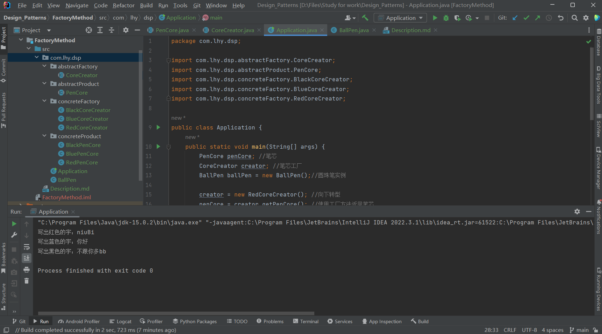

# 工厂方法模式 Factory Method 

工厂模式提供了一种将对象的实例化过程封装在工厂类中的方式。

通过使用工厂模式，可以将对象的创建与使用代码分离，提供一种统一的接口来创建不同类型的对象。

在工厂模式中，我们在创建对象时不会对客户端暴露创建逻辑，并且是通过使用一个共同的接口来指向新创建的对象。

## 意图

定义一个创建对象的接口，让其子类自己决定实例化哪个工厂类，使得对象创建过程延迟到子类进行。

## 主要解决

接口选择的问题。

## 何时使用

- 明确知道不同情况创建不同对象时；
- 用户需要一个子类的实例，但不希望与该类的子类形成耦合；
- 用户需要一个类的实例，但不知道该类有哪些子类可用。

## 设计关键

- 让其子类实现工厂接口，返回一个抽象的产品。

- 创建对象的过程在子类种进行。

## 核心角色

工厂模式包含以下几个关键角色：

- 抽象产品 Abstract Product

    定义了产品的属性和行为的抽象类或接口。

- 具体产品 Concrete Product

    抽象产品的子类/实现类，定义了具体产品的特定属性和行为。

- 抽象工厂 Abstract Factory

    声明了创建产品的抽象方法，可以是接口或抽象类。它可以有多个方法用于创建不同类型的产品。

- 具体工厂 Concrete Factory

    实现了抽象工厂接口，负责实际创建具体产品的对象。

## 代码实例

https://github.com/Uchiha-Minato/Study-Java/tree/main/Design_Patterns/FactoryMethod

 

## 具体应用实例

**1.Java集合Collection框架**

Collection接口种的iterator()方法就是工厂方法

Iterator接口是抽象产品，Collection是抽象工厂，实现Collection接口的类是具体工厂

用户遍历集合中的对象时，可以调用iterator()方法返回一个实现了Iterator接口的类的实例，用户只需了解Iterator接口有哪些方法即可，不需要知道返回的实例是哪个类创建的。

    Module java.base package java.util
    public interface Collection<E> extends Iterator<E>
    
    集合层次结构的根接口。JDK不提供此接口的任何直接实现:它提供了更具体的子接口(如Set和List)的实现。该接口通常用于传递集合，并在需要最大通用性的情况下对其进行操作。

    Iterator<E> iterator()方法
    返回此集合中元素的迭代器。对于元素返回的顺序没有保证(除非此集合是提供保证的某个类的实例)。

例如：*使用iterator()方法返回的实例 遍历集合*

    Collection<Integer> myList = new ArrayList<>();
    for(int i = 1; i < 10; i++) {
        myList.add(new Integer(i));
    }
    Iterator<Integer> iter = myList.iterator();
    while(iter.hasNext()) {
        sout(iter.next());
    }

**2.Java消息服务 Java Messaging Service(JMS)**

**3.JDBC**

Connection接口的createStatement()方法即是工厂方法。

 

## 优缺点

**优点：**

- 使用工厂方法可以让用户的代码和某个特定类的子类的代码解耦。
- 工厂方法使用户不必知道它所使用的对象是怎样被创建的，只需知道该对象有哪些方法即可。

**缺点：**

- 每次增加一个产品时，都需要增加一个具体类和对象实现工厂，使得系统中类的个数成倍增加，在一定程度上增加了系统的复杂度，同时也增加了系统具体类的依赖。这并不是什么好事。

    