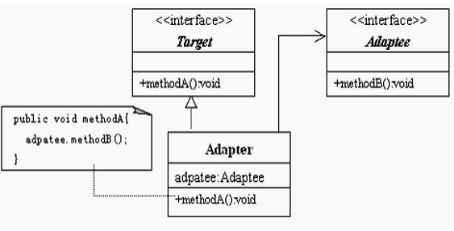
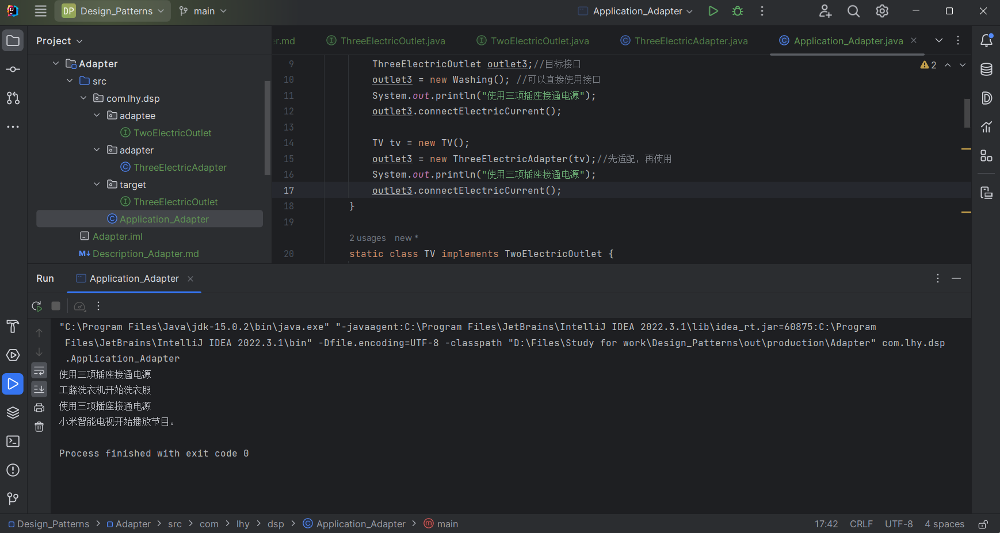

# 适配器模式 Adapter

适配器模式是作为两个不兼容的接口之间的桥梁。

Adapter模式使得原本由于接口不兼容而不能一起工作的那些类可以一起工作。

## 意图

将一个类的接口转换成客户希望的另一个接口。

## 主要解决

在软件系统中，常常要将一些“现存的对象”放到新环境中，而新环境要求的接口是现对象不能满足的。

## 何时使用

- 一个程序想使用*已经存在的类*，但该类所实现的接口和当前程序所使用的接口不一致；
- 通过接口转换，将一个类插入另一个类系中；
- 想要建立一个可以重复使用的类，用于与一些彼此之间没有太大关联的一些类，包括一些可能在将来引进的类一起工作，这些源类不一定有一致的接口。

## 设计关键

**建立一个适配器，这个适配器实现了目标接口并包含有被适配者的引用。**

## 核心角色

适配器模式包含三种角色：

- 目标 Target 客户想使用的接口
- 被适配者 Adaptee 已经存在的接口或抽象类，需要适配
- 适配器 Adapter 实现目标接口并包含被适配者的引用

## UML类图

## 代码示例

https://github.com/Uchiha-Minato/Study-Java/tree/main/Design_Patterns/Adapter

### 双向适配器

如果Adapter同时实现目标接口和被适配接口，并包含目标和被适配者的引用

则该适配器就是一个双向适配器。

使用这种适配器，用户既可使用新的接口也可以使用已有接口。

 

## 具体应用实例

- **1. JDBC**

    使得用户程序能使用SQL的API。

- **2. JVM**

    使得Java程序能跨平台运行。

## 优点 & 缺点

**优点**

- 目标Target和被适配者Adaptee是完全解耦的关系；
- 满足“开-闭原则”。

    当添加一个实现Adaptee接口的新类时，
    不必修改Adapter也能对其进行适配。

**缺点**

- 过多使用此模式会使得调用关系变得非常凌乱。