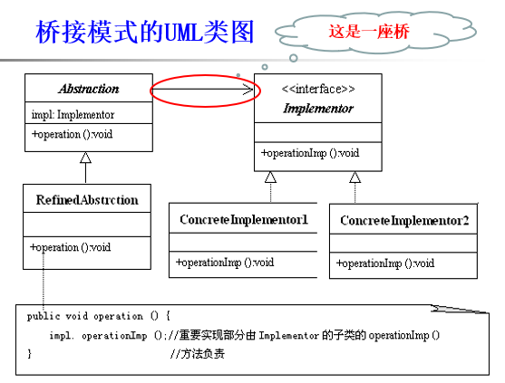
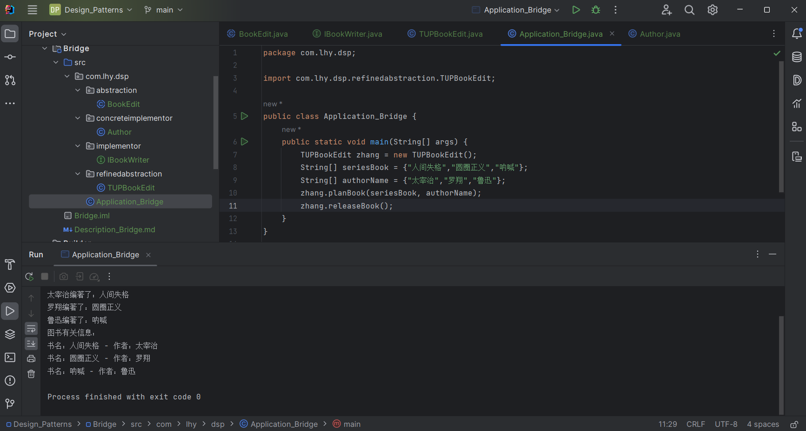

# 桥接模式 Bridge

将抽象部分与它的实现部分分离，使这两部分可以独立变化。

## 意图

通过组合的方式，而不是继承的方式，将抽象和实现的部分连接起来。

## 主要解决

在有多种可能会变化的情况下，使用继承会造成的类爆炸问题

## 何时使用

- 需要让抽象和某些重要的实现解耦；
- 一个类存在两个独立变化的维度，且这两个维度都需要进行扩展；
- 不希望使用多层继承使得系统类个数增加；
- 抽象化角色和实现化角色可以以继承的方式独立扩展而互不影响。

## 设计关键

**抽象类含有实现类的引用。**

## 核心角色

- 抽象角色 Abstraction 

    一个引用了Implementor对象的抽象类.

- 实现者 Implementor 

    一个负责定义基本操作的接口或抽象类。

- 细化抽象 Refined Abstraction 

    重写抽象角色中的方法，委托Implementor对象调用相应的方法。

- 具体实现者 Concrete Implementor

    实现者接口的实现类。

## UML类图

## 代码示例

https://github.com/Uchiha-Minato/Study-Java/tree/main/Design_Patterns/Bridge

 

## 具体应用实例

**1. Java跨平台基础**

**2. JDBC DriverManager**

    一个JDBC驱动程序可以动态地将一个特定类型的数据库与一个Java应用程序绑定在一起，从而实现抽象角色与实现角色的动态耦合。

## 优点 & 缺点

**优点**

- 桥接模式分离了抽象与实现，使得两部分可以独立扩展；

    当修改实现的代码时，不影响抽象的代码，反之也一样。

- 满足“开-闭原则”；

- 可以对用户隐藏实现细节。

**缺点**

- 会增加系统的理解与设计难度；

    因为是抽象类引用抽象接口。

- 模式要求正确识别出系统中两个独立变化的维度，因此适用范围有局限性。