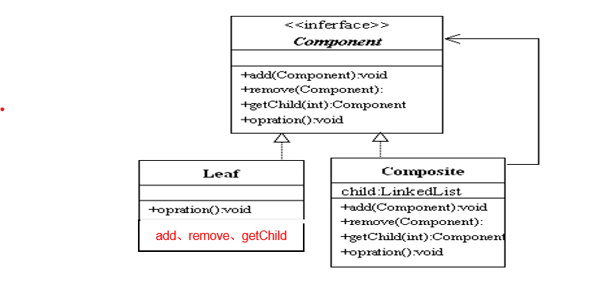
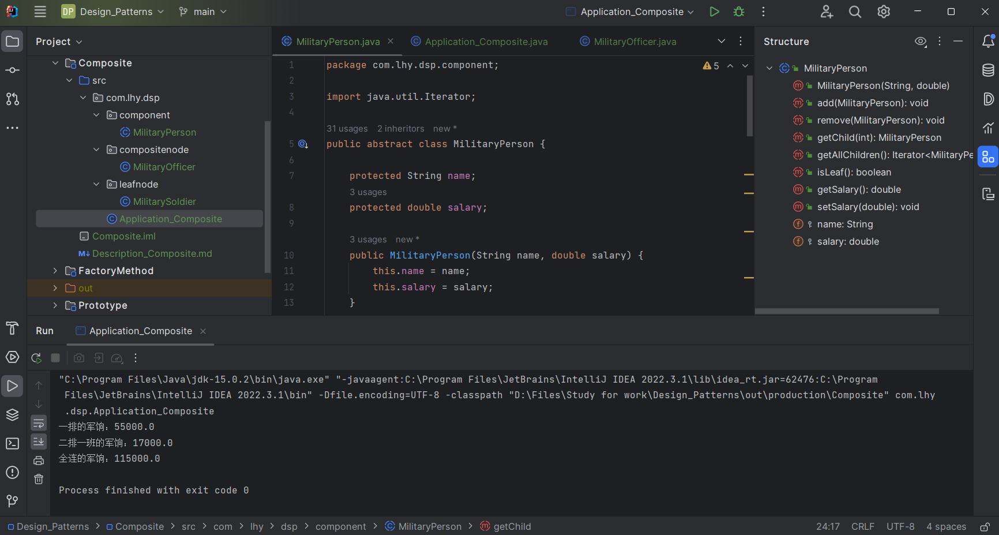

# 组合模式 Composite

又称**部分-整体模式**。

用于把一组相似的对象当作一个单一的对象。

## 意图

将对象组合成*树形结构*以表示**部分-整体**的层次结构。

组合模式能让客户以*一致的方式*处理个别对象和组合对象。

## 主要解决

在有关树形结构的问题中，模糊了复杂元素和简单元素的概念，客户程序可以像处理简单元素一样处理复杂元素。

从而使得客户程序与复杂元素的内部解耦。

## 何时使用

- 需要表示树形结构时；
- 希望用户忽略单个对象和组合对象的异同，统一地使用对象。

## 设计关键

**无论是个体对象还是组合对象都实现了相同的接口或都是同一个抽象类的子类。**

同时，*非根节点的父结点有存放孩子结点的集合。*

## 核心角色

- 抽象组件 Component

    一个接口（抽象类），定义了个体对象和组合对象需要实现的关于操作其子结点的方法。

- Composite结点 Composite Node

    抽象组件的实现类或子类。
    包含有其他Composite结点或Leaf结点的引用。

- Leaf结点 Leaf Node

    抽象组件的实现类或子类。
    不可以含有其他Composite结点或Leaf结点的引用。

## UML类图

## 代码实例

https://github.com/Uchiha-Minato/Study-Java/tree/main/Design_Patterns/Composite

 

## 具体应用实例

**1. 文件资源管理器**

**2. 算数表达式**

算术表达式包括操作数、操作符和另一个操作数，其中，另一个操作数也可以是操作数、操作符和另一个操作数。

## 与其他模式的关系

- 与命令模式

    可以应用到命令类的合成，几个具体命令合成一个宏命令。

- 与迭代器模式

    组合模式常常使用迭代器模式遍历子类对象。

- 与责任链模式

    一个责任链模式往往应用到一个树结构上。
    因此会使用到组合模式，迭代器模式和装饰模式。

## 优点 & 缺点

- 用户可以方便地处理个体对象和组合对象；

- 用户一般不需区分个体对象和组合对象；

- 满足“开-闭原则”。

    当增加新的Composite结点和Leaf结点时，无需修改原有代码。
