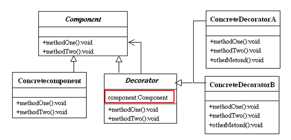
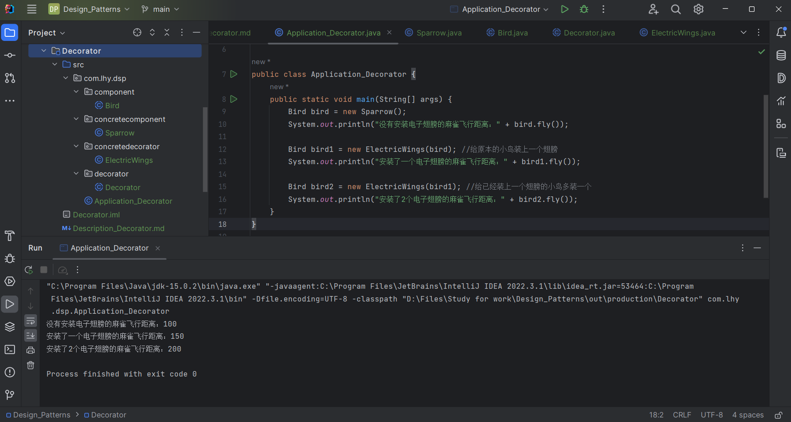

# 装饰模式 / 包装器  Decorator / Wrapper

允许向一个现有的对象添加新的功能，同时又不改变其结构。

通过将对象包装在装饰器类中，以便动态地修改其行为。

## 意图

动态地给一个对象添加一些额外的职责。

就增加功能来说，装饰器模式比生成子类更加灵活。

## 主要解决

使用继承扩展类时子类的膨胀问题。

## 何时使用

- 在不想增加很多子类的情况下扩展子类；
- 希望动态地增强类的某个对象的功能，而又不影响到该类的其他对象；
- 需要增加由一些基本功能排列组合而产生的功能集合。

## 设计关键

**利用组合的做法扩展对象的行为。**

*具体组件 和 装饰 都是 抽象组件 的子类。*

## 核心角色

- 抽象组件 Component

    一个抽象类。

- **具体组件 ConcreteComponent**

    抽象组件的子类。

- 抽象装饰 Decorator

    也是抽象组件的子类。
    还包含一个抽象组件声明的变量，以保存“被装饰者的引用”。

- **具体装饰 ConcreteDecorator**

    装饰的一个非抽象子类。

## UML类图

## 代码实例

https://github.com/Uchiha-Minato/Study-Java/tree/main/Design_Patterns/Decorator

 

## 具体应用实例

**1. Java I/O 标准库**

- InputStream 的子类 FilterInputStream
- OutputStream 的子类 FilterOutputStream
- Reader 的子类 BufferedReader / FilterReader
- Writer 的子类 BufferedWriter / FilterWriter / PrintWriter等

他们都是抽象装饰类，包含了被装饰者（父类）的引用。

例如：

    JDK 17 package java.io 
    public class FilterInputStream
        extends InputStream {
        //被装饰者的引用
        protected InputStream in;
        //被装饰者当成参数传入构造
        protected FilterInputStream(InputStream in) {...}
        ...
    }

InputStream类提供基础功能。若功能需要增强，则交给它的子类进行装饰即可。

*注意，FilterInputStream的构造具有protected权限。*

*2. 咖啡店订单系统*

购买咖啡可以加各种调料。

## 优点 & 缺点

**优点：**

- 被装饰者和装饰者是*松耦合*关系；
- 满足“开-闭原则”；
- 可以使用多个具体装饰来装饰具体组件的实例。

**缺点：**

使用装饰模式会产生比继承更多的对象，会使得查错变得困难。

*尤其是这些对象看上去都很相像。*