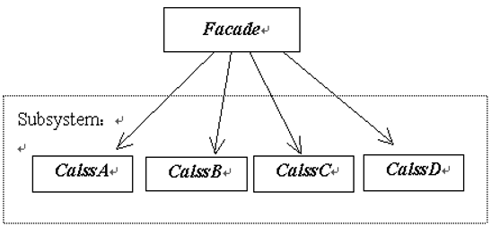
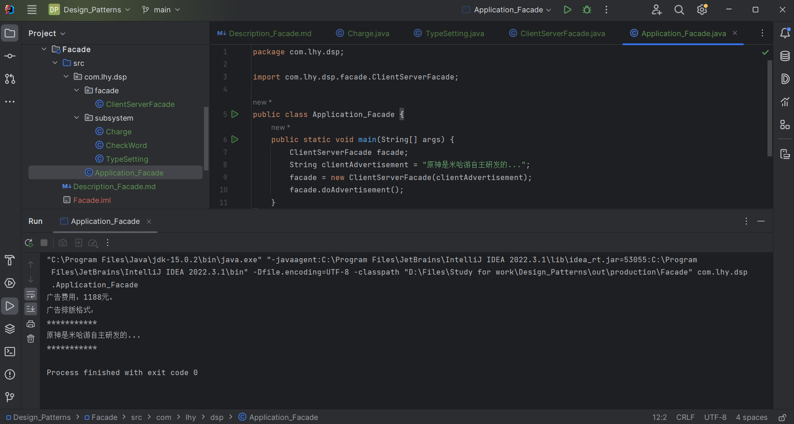

# 外观模式 Facade

Facade /fəˈsɑːd/ 假象、外观

隐藏系统的复杂性，并向客户端提供了一个访问系统的接口。

## 意图

为子系统中的一组接口提供一个*一致的界面*，外观模式定义了一个高层接口，这个接口使得这一**子系统更加容易使用。**

## 主要解决

降低访问复杂系统的内部子系统的复杂度，**简化接口**。

## 何时使用

- 客户端不需要知道系统内部的复杂联系；
- 需要为用户提供一个简单的交互操作；
- 不希望客户代码和子系统的类有耦合；
- 不希望多个子系统相互之间直接交互。

## 关键实现

为子系统提供一个称作外观的类，该**外观类的实例负责和子系统中类的实例打交道。**

## 核心角色

- 子系统 Subsystem

    若干个类的集合。
    这些类的实例合作为用户提供所需的功能。
    子系统中的任何类都不包含对外观类实例的引用。

- 外观 Facade

    一个包含了子系统中全部或部分类的实例引用
    用于和用户交互。

## UML类图

## 代码示例

https://github.com/Uchiha-Minato/Study-Java/tree/main/Design_Patterns/Facade

 

## 具体应用实例

**1. J2EE模式 MVC开发**

*几乎所有系统的开发都会用到外观模式。*

## 优点 & 缺点

**优点：**

- 使客户和子系统中的类无耦合，并使子系统的使用更加方便；
- 外观只是提供了一个更加简洁的界面，不影响用户使用子系统中的类；
- 子系统中任何代码的修改都不会影响到外观。

**缺点：**

- 不能很好地限制客户使用子系统类；

    若对访问限制太多，则会减少系统的灵活性。

- 在不引入抽象外观类的情况下，增加新的子系统可能需要修改外观类或客户端的源代码。

    违背了“开-闭原则”。