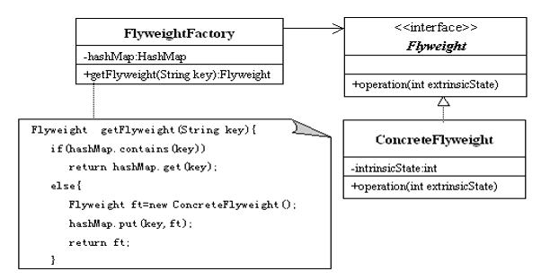
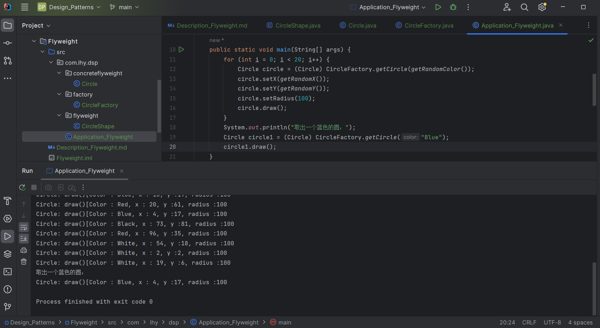

# 享元模式 Flyweight

通过**共享**实现相同或相似对象的重用。

在享元模式中可以共享的相同内容称为 *内部状态*;

需要外部环境来设置的不能共享的内容称为 *外部状态*。

## 意图

运用共享技术有效地支持大量细粒度的对象。

## 主要解决

在有大量对象时，有可能会造成内存溢出。

把其中共同的部分抽象出来，如果有相同的业务请求，直接返回在内存中已有的对象，避免重新创建。

## 何时使用

- 系统中有大量对象消耗大量内存，这些对象的大部分状态可以外部化；
- 系统中使用大量的对象，这些对象之间部分属性本质上是相同的。

## 关键实现

创建一个**享元工厂类**，用于提供一个存储享元对象的**享元池**（如HashMap）。

用户需要对象时，首先从享元池获取。

如果享元池中不存在，则创建一个新的享元对象返回给用户，并在池中保存此新增的对象。

典型享元工厂类：

    public class FlyweightFactory {
        private HashMap flyweights = new HashMap();
        public Flyweight getFlyweight(String key) {
            if(flyweight.containsKey(key)) {
                return (Flyweight)flyweights.get(key);
            } else {
                Flyweight fw = new ConcreteFlyweight();
                flyweight.put(key, fw);
                return fw;
            }
        }
    }

## 核心角色

- 享元接口 Flyweight

    所有具体享元类的父类或接口。
    通过这个接口，可以向外界提供对象的内部状态，设置外部状态。

- 具体享元 Concrete Flyweight

    享元接口的子类或实现类。
    为内部状态增加存储空间。

- 享元工厂 Flyweight Factory

    用来创建并管理享元对象，可以使用单例模式设计享元工厂。
    享元池一般使用HashMap。

## UML类图

## 代码示例

https://github.com/Uchiha-Minato/Study-Java/tree/main/Design_Patterns/Flyweight

 

## 模式扩展 - 与其他模式联用

1. 在享元工厂类中提供一个静态的工厂方法返回享元对象。

    使用简单工厂模式来生成享元对象。

2. 在一个系统中，通常只有一个享元工厂。

    可以使用单例模式进行享元工厂的设计。

3. 享元模式可以结合组合模式形成复合享元模式，统一对享元对象设置外部状态。

## 具体应用实例

**1. JVM - StringTable 串池**

在创建字符串对象时，查看串池中是否有特定字符串。

有则引用相同对象，无则创建加入串池。

**2. JDBC连接池**

**3. 线程池**

## 优点 & 缺点

**优点：**

- 使用享元可以减少内存中对象的数量，节省内存的开销；
- 外部状态相对独立，不影响内部状态。

**缺点：**

- 享元模式会使系统变得复杂；
- 为了节省内存，分离出外部状态，使得运行时间变长。

    用时间换取了空间。