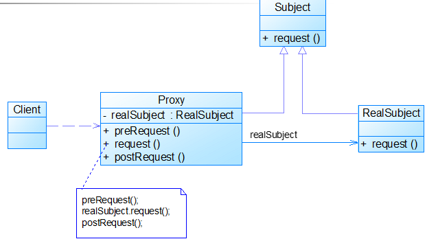
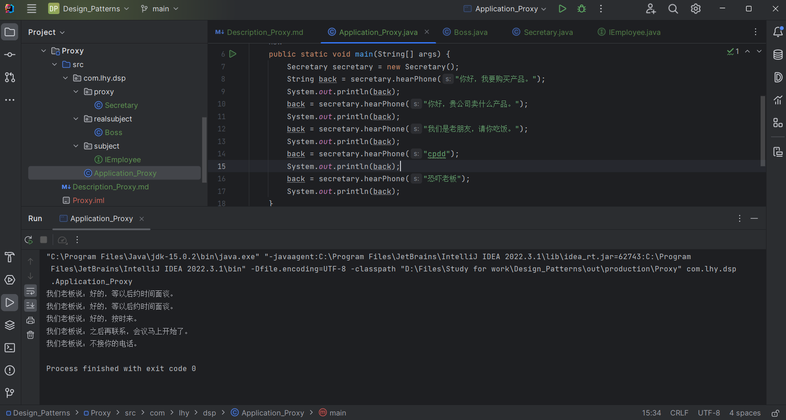
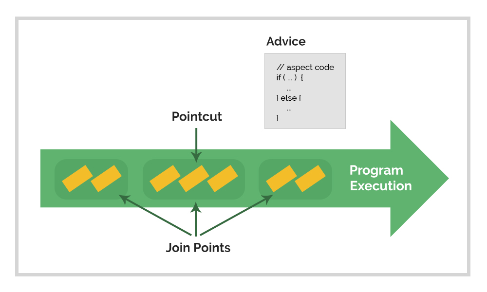

# 代理模式 Proxy

在某些情况下，一个客户**不想或不能直接引用**一个对象。

此时可以通过一个称之为“代理”的第三者来实现*间接引用*。

代理对象可以在客户端和目标对象之间起到中介的作用，并可以通过代理对象去掉客户不能看到的内容和服务或是添加客户所需的额外服务。

## 意图

为其他对象提供一种代理以控制对这个对象的访问。

***代理就是真实对象派来的代表。***

## 主要解决

在直接访问对象时带来的种种问题。如：
- 要访问的对象在远程的机器中；
- 直接访问麻烦重重等。

## 何时使用

- 程序可能不希望用户直接访问该对象，而是提供一个特殊的对象以控制对当前对象的访问；

    安全代理。

- 一个对象需要很长的时间才能加载完成（如图片）；

    虚拟代理。

- 对象位于远程主机上，需要为用户提供访问该远程对象的能力。

    远程代理。

## 代理模式的常见情况

### 1. 远程代理

为一个对象在不同的地址空间提供局部代表。解决远程访问问题。

### 2. 虚拟代理

根据需要创建开销很大的对象。通过这个对象来存放实例化需要较长时间的真实对象。

*浏览器中用代理模式优化下载。*

此外，还有动态代理、安全代理和计数代理等。

## 关键实现

**代理类含有真实对象的引用**，可以操作真实对象；

同时，**代理类和真实对象实现相同的接口**，在任何时候都能代替真实对象。

典型的代理类写法：

    public class Proxy implements Subject {
        private RealSubject realSubject = new RealSubject();
        public void preRequest() {...}
        public void request() {
            preRequest();
            realSubject.request();
            postRequest();
        }
        public void postRequest() {...}
    }

## 核心角色

- 抽象主题 Subject

    一个共用接口。

- 实际主题 RealSubject

    实现了共用接口，类的实例为被代理的对象。

- 代理 Proxy

    保存一个实际主题对象的引用，并实现共用接口。

## UML类图

## 代码示例

https://github.com/Uchiha-Minato/Study-Java/tree/main/Design_Patterns/Proxy

 

## 具体应用实例

### **1. Spring AOP**

AOP - Aspect-Oriented Programming 面向切面编程

    AOP是OOP的补充，是GOF的延续。

在软件开发中，散布于应用中的*各种功能*被称为**横切关注点**
（如日志、安全、事务管理）。

通常，这些关注点在概念上与业务逻辑相分离。

    但是往往会直接嵌入到应用的业务逻辑中。

把这些横切关注点与业务逻辑相分离，正是AOP要解决的问题。

切面可以被描述为影响应用多处的功能，AOP则是模块化这些切面。

在使用AOP时，我们仍然在一个地方定义通用功能，但是可以通过声明的方式定义这个功能要以何种方式在何处应用，而无需修改受影响的业务逻辑类。

术语：

- **横切关注点**

    跨越应用程序多个模块的方法或功能。
    即是与我们业务逻辑无关的，但是我们需要关注的部分，就是横切关注点。
    如日志、安全、缓存、事务等等。

- **连接点**

    在应用执行中能插入切面的点。
    即程序执行过程中能够应用通知的所有点。

- **切点**

    是真正需要插入切面的一个或多个连接点。
    即通知被应用的具体位置。

- **通知**

    切面的工作被称为通知。
    即包含了需要用于多个应用对象的横切行为。

Spring切面可以应用5种类型的通知：

- 前置(Before)
- 后置(After)
- 返回(After-returning)
- 异常(After-throwing)
- 环绕(Around)

- **切面**

    是通知和切点的结合。
    定义了切面：是什么，在何时和何处完成了功能。

- **织入**

    织入是把切面应用到目标对象并创建新的代理对象的过程。
    切面在指定的连接点被织入到目标对象中。在目标对象的生命周期里有多个点可以进行织入:
    编译期 类加载期 运行期

- **引入**

    指向现有类添加新方法或属性。

**Spring对AOP的支持方式：**

- Spring AOP

    通过动态代理构建，因此只支持方法级别的切点。

- 注入式AspectJ切面

    提供构造器、字段级别的切点。（比Spring AOP更细粒度）

***Spring AOP 为 动态代理（Dynamic Proxy）。***

通过在代理类中包裹切面，Spring在运行期把切面织入到Spring管理的bean中。

代理类封装了目标类，并拦截被通知方法的调用，再把调用转发给真正的目标bean。

在代理拦截到方法调用时，在调用目标bean方法之前，会执行切面逻辑。

https://www.baeldung.com/spring-aop

**2. Java RMI 远程方法调用。**

## 优点 & 缺点

**优点：**

- 使用户与真正的对象之间解耦；
- 使用代理来担当那些创建耗时的对象的替身。

**缺点：**

- 请求的处理速度会变慢；
- 实现代理模式需要额外的工作；
- 有些代理实现起来比较复杂。