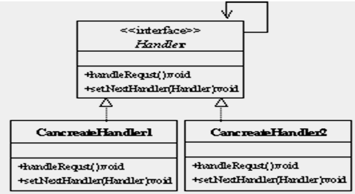
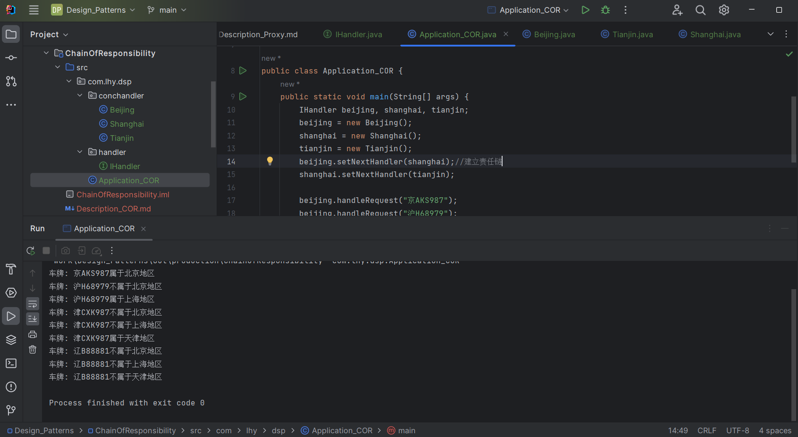

# 责任链模式 Chain of Responsibility

顾名思义，为请求创建了一个接收者对象的链。

是使用多个对象处理用户请求的成熟模式。

## 意图

使多个对象都有机会处理请求，从而避免请求的发送者和接收者之间的耦合关系。

将这些对象连成一条链，并沿着这条链传递该请求，知道有一个对象处理它为止。

## 主要解决

使请求发送者和接收者解耦，客户只需把请求发送到责任链上即可，无需关心请求的传递和细节的处理。

## 何时使用

- 有许多对象可以处理用户的请求，希望程序在运行期间自动确定处理用户请求的那个对象；
- 希望用户不必明确指定接受者的情况下，向多个接收者提交一个请求；
- 程序希望动态指定可以处理用户请求的对象集合。

## 纯与不纯的责任链模式

**纯的责任链：**

一个具体处理者角色处理只能对请求作出两种行为中的一个：
- 自己处理（承担责任）；
- 把所有责任推给下家。

不允许出现某一个具体处理者对象在承担了一部分责任后又向下传递的情况。

*反之就是不纯的责任链。*

## 关键实现

- *每个对象含有后继对象的引用；*
- *责任链模式不创建责任链；*
- *模式不指定责任链的拓扑结构。*

## 核心角色

- 处理者 Handler

    一个接口，规定了处理用户请求的方法和设置后继对象的方法。

- 具体处理者 Concrete Handler

    接口的实现类。

**由于Java不支持多继承，Handler最好不是抽象类，否则具体处理者无法继承其他类，将会限制具体处理者的能力。**

## UML类图

## 代码示例

https://github.com/Uchiha-Minato/Study-Java/tree/main/Design_Patterns/ChainOfResponsibility

 

## 具体应用实例

**1. JavaScript中的事件冒泡。**

**2. JSP Servlet的Filter过滤器。**

## 优点 & 缺点

**优点：**

- 责任链中的对象只和自己的后继处理者是*低耦合*关系；

    与其他对象毫无关联。因此创建新的处理者对象时非常容易。

- 当在处理者中分配职责时，责任链给应用程序更高的灵活性；
- 应用程序可以动态地增加、删除处理者或重新指派处理者的职责；
- 应用程序可以动态地改变处理者之间的先后顺序；
- 用户不需要知道请求如何传递以及被谁处理。

**缺点：**

- 不能保证请求一定会被接收到；
- 系统性能将受到一定影响，可能会造成循环调用。