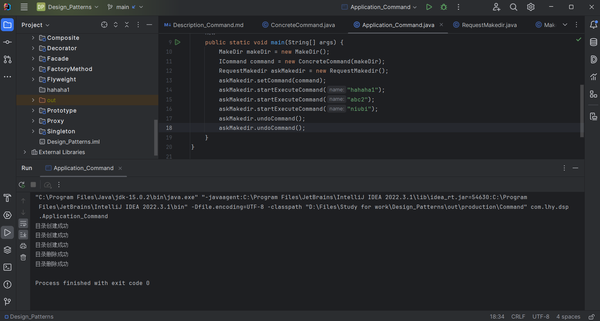

# 命令模式 Command

请求以命令的形式包裹在对象中，并传给调用对象。

调用对象寻找可以处理该命令的合适的对象，并把该命令传给相应的对象，该对象执行命令。

对请求排队或记录请求日志，以及支持可撤销的操作。

## 意图

将一个请求封装为一个对象，从而使用户可用不同的请求对客户进行参数化。

## 主要解决

在许多设计中，经常涉及到一个对象请求另一个对象调用其方法达到目的。

如果**请求者不希望或无法直接和被请求者打交道(含有引用)**，就使用此模式。

## 何时使用

- 需要将请求调用者和请求接收者解耦；
- 需要在不同的时间指定请求、将请求排队和执行请求；
- 需要支持命令的撤销(Undo)和恢复(Redo)。

## 关键实现

*引入抽象命令接口，发送者针对抽象命令接口编程。*

只有实现了抽象命令接口的具体命令才能和接收者关联。

## 核心角色

- 命令接口 Command

    封装了execute() undo()等方法。

- 具体命令 ConcreteCommand

    实现命令中的方法。

- 请求者 Invoker

    包含Command接口变量。

- 接收者 Receiver

    负责执行与请求相关的操作。

## UML类图

## 代码示例

https://github.com/Uchiha-Minato/Study-Java/tree/main/Design_Patterns/Command

 

## 具体应用实例

**1. Java使用命令模式实现AWT/Swing GUI的委派事件模型。**

    Delegation Event Model, DEM

Frame、Button等界面组件是请求发送者

AWT提供的事件监听器接口和事件适配器类是抽象命令

用户自己编写抽象命令的子类来实现事件处理。

*对于界面组件而言，只需要了解命令接口即可，不关心实现。*

*对于组件类，不关心实际操作，因为实际操作由用户实现。*

**2. Linux Shell程序**

可以将多条命令封装在一个命令对象中，只需要执行一条简单的命令即可执行一个命令序列。

## 优点 & 缺点

**优点：**

- 彻底消除了请求者与接收者之间的耦合；
- 满足“开-闭原则”；
- 使用命令模式可以记录日志，可以对请求者的请求进行排列。

**缺点：**

- 会使某些系统有过多的具体命令类。