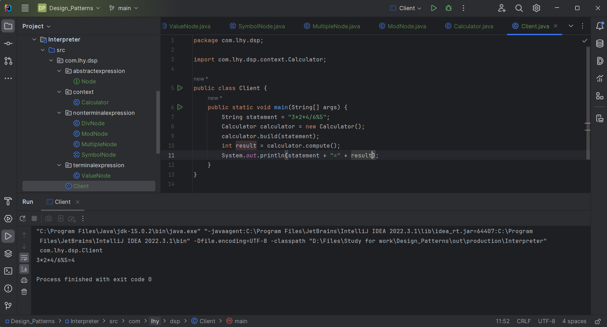

# 解释器模式 Interpreter

解释器模式是关于**怎样实现一个简单语言**的成熟模式。

这种模式实现了一个表达式接口，该接口解释一个特定的上下文。

解释器模式描述了如何为*简单的语言*：
* 定义一个文法
* 如何在该语言中表示一个句子
* 如何解释这些句子

## 意图

给定一个语言，定义它的文法的一种表示，并定义一个解释器。

这个解释器使用该表示来解释语言中的句子。

## 主要解决

对于一些固定文法构建一个解释句子的解释器。

## 何时使用

如果一种特定类型的问题发生的频率足够高，那么可能就值得将该问题的各个实例表述为一个简单语言中的句子。

这样一来就可以构建一个解释器，该解释器通过解释这些句子来解决该问题。

## 关键实现

*将每一个语法规则表示成一个类。*

## 核心角色

- 抽象表达式 AbstractExpression

    定义解释器的接口，约定解释器的解释操作，主要包含解释方法 interpret()。

- 终结符表达式 TerminalExpression

    是抽象表达式的子类，用来实现文法中与终结符相关的操作,
    文法中的每一个终结符都有一个具体终结表达式与之相对应。

- 非终结符表达式 NonterminalExpression

    也是抽象表达式的子类，用来实现文法中与非终结符相关的操作，
    文法中的每条规则都对应于一个非终结符表达式。

- 上下文 Context

    通常包含各个解释器需要的数据或是公共的功能。
    一般用来传递被所有解释器共享的数据，后面的解释器可以从这里获取这些值。

## UML类图

## 代码示例

https://github.com/Uchiha-Minato/Study-Java/tree/main/Design_Patterns/Interpreter

 

## 具体应用实例

- 1. 解释器模式在使用面向对象语言实现的编译器中得到了广泛的应用，如Smalltalk语言的编译器。

- 2. 目前有一些基于Java抽象语法树的源代码处理工具，如在Eclipse中就提供了Eclipse AST，它是Eclipse JDT的一个重要组成部分，用来表示Java语言的语法结构，用户可以通过扩展其功能，创建自己的文法规则。

- 3. 可以使用解释器模式，通过C++、Java、C#等面向对象语言开发简单的编译器，如数学表达式解析器、正则表达式解析器等，用于增强这些语言的功能，使之增加一些新的文法规则，用于解释一些特定类型的语句。

## 优点 ＆ 缺点

**优点**

* 将每一个语法规则表示成一个类，方便实现简单的语言；
* 由于使用类表示语法规则，可以较容易改变或扩展语言的行为；
* 通过在类结构中加入新的方法，可以在解释的同时增加新的行为。

**缺点**

* 对于复杂文法难以维护；
* 执行效率较低；
* 应用场景很有限。