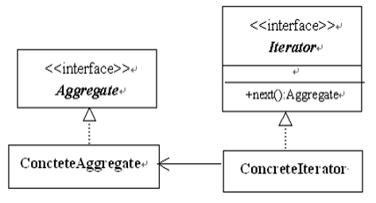
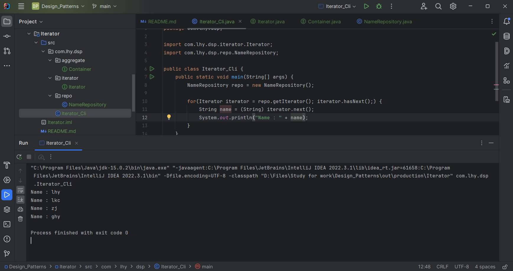

# 迭代器模式 Iterator - 别名：游标 Cursor

迭代器模式（Iterator Pattern）是 Java 和 .Net 编程环境中非常常用的设计模式。

这种模式用于顺序访问集合对象的元素，不需要知道集合对象的底层表示。

## 意图

提供一种方法顺序访问一个聚合对象中的各个元素，而又不需要暴露该对象的内部表示。

## 主要解决

如何遍历**整个整合对象**。

## 何时使用

需要遍历一个聚合对象时。

## 关键实现

将遍历集合的任务交给一个称作迭代器的对象。

## 枚举Enumeration和迭代器Iterator的区别

枚举接口是从以往的Java版本中遗留下来。这个接口尽管没有被放弃，但已经被迭代器所替代。

枚举对新程序来说是过时的。然而它仍然被几种从以前版本遗留下来的类(Vector和Properties)所定义的方法使用，被几种其他的API类所使用以及被目前广泛使用的应用程序所使用。

迭代器允许在迭代期间移除元素，而枚举不具备删除功能。

## 核心角色

- 集合 Aggregate

    一个接口，规定了具体集合所需要实现的操作。

- 具体集合 Concrete Aggregate

    实现集合接口，按规定的结构存储对象。
    其中一个方法返回一个针对该集合的具体迭代器。

- 迭代器 Iterator

    一个接口，规定了遍历具体集合的方法。

- 具体迭代器 Concrete Iterator

    实现迭代器接口。

**由于很多编程语言的类库都已经实现了迭代器模式**，因此在实际使用中我们很少自定义迭代器，只需要直接使用Java、C#等语言中已定义好的迭代器即可，迭代器已经成为我们操作聚合对象的基本工具之一。

## UML类图



## 代码示例

https://github.com/Uchiha-Minato/Study-Java/tree/main/Design_Patterns/Iterator



<br>

## 具体应用实例

**1. java.util.Iterator< E >**

集合上的迭代器。在Java集合框架中，迭代器取代了枚举。

迭代器与枚举在两个方面不同:

* 迭代器允许调用者在迭代期间使用定义良好的语义从底层集合中删除元素。
* 方法名得到了改进。

该接口是Java集合框架的成员。

可以使用Enumeration. asiterator()方法将枚举转换为迭代器。

*使用迭代器遍历List集合的一般写法：*

```java
List list = new ArrayList<>();

list.add(1);
list.add(2);
list.add(3);

//获取迭代器
Iterator iterator = list.iterator();
//通过循环迭代
while(iterator.hasNext()) {
    int j = (int) iterator.next();
    sout(j);
}
```

**2. Android SQLite查找出来的数据使用Cursor对象存储**

## 迭代器模式的优点

- 完美地符合了迪米特法则；
- 用户使用迭代器访问集合中的对象，而不需要知道这些对象在集合中是如何表示及存储的；
- 用户可以同时使用多个迭代器遍历一个集合。