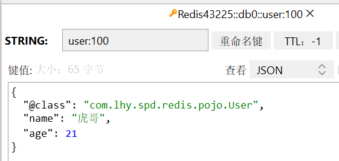
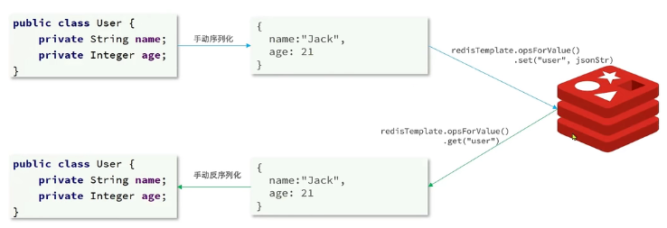

# Redis的Java客户端

常用的有三种：
* Jedis 
    
    以Redis命令作为方法名称，学习成本较低
    但是Jedis实例线程不安全，多线程环境下需要基于连接池使用

* Lettuce （Spring默认兼容）

    Lettuce是基于Netty实现（高性能的网络编程框架）
    支持同步、异步和响应式编程方式，线程安全
    支持Redis的哨兵模式、集群模式和管道模式

* Redisson

    是一个基于Redis实现的分布式、可伸缩的Java数据结构集合。
    包含了诸如Map、Queue、Lock、Semaphore、AtomicLong等功能

## Jedis使用步骤

### 1. 引入依赖

maven：

```
    <dependency>
        <groupId>redis.clients</groupId>
        <artifactId>jedis</artifactId>
        <version>4.3.1</version>
    </dependency>
```

Gradle:
```
    repositories {
        mavenCentral()
    }
    //...
    dependencies {
        implementation 'redis.clients:jedis:4.3.1'
        //...
    }
```

### 2. 创建Jedis对象，建立连接

```
    private Jedis jedis;

    //jedis = new Jedis(String host, int port);
    jedis = new Jedis("192.168.43.225", 6380);
    jedis.auth("123456"); //设置登录密码
    jedis.select(0); //选择0号数据库
```

### 3. 开始操作

*方法名就是命令*

如：

    jedis.hset("user:1", "name", "Jack");
    jedis.hset("user:1", "age", "21");
    Map<String, String> map = jedis.hgetAll("user:1");

### 4. 释放连接

    jedis.close();

### Jedis连接池

Jedis本身是线程不安全的，并且频繁地创建和销毁连接会有性能损耗。因此使用连接池来代替直连。

```java
public class JedisConnectionFactory {
    private static final JedisPool jedisPool;

    static {
        // 配置连接池
        JedisPoolConfig config = new JedisPoolConfig();
        // 配置连接池
        config.setMaxTotal(8); // 最大连接数
        config.setMaxIdle(8); // 最大空闲连接
        config.setMinIdle(0); // 最小空闲连接
        config.setMaxWaitMillis(1000);
        // 创建连接池对象
        jedisPool = new JedisPool(config,
                "192.168.43.225", 6380, 1000,"123456");
    }

    public static Jedis getJedis() {
        return jedisPool.getResource();
    }
}
```

## SpringDataRedis

SpringDataRedis是Spring中数据操作的模块，包含对各种数据库的集成。

*其中对Redis的集成模块就叫SpringDataRedis。*

https://spring.io/projects/spring-data-redis

* 提供了对不同Redis客户端的整合（Lettuce和Jedis）
* 提供了RedisTemplate统一API来操作Redis
* 支持Redis哨兵(Redis-sentinel)和集群(Redis-cluster)
* 支持基于Lettuce的响应式编程
* 支持基于JDK、JSON、字符串、Spring对象的数据序列化及反序列化
* 支持基于Redis的JDKCollection实现

### 方案一 ：自定义RedisTemplate

SpringDataRedis中提供了RedisTemplate工具类，其中封装了各种对Redis的操作。并且将不同数据类型的操作API封装到了不同的类型中。

|API|返回值类型|说明|
|---|---|---|
|redisTemplate.opsForValue()|ValueOperations|操作String类型数据|
|redisTemplate.opsForHash()|HashOperations|操作Hash类型数据|
|redisTemplate.opsForList()|ListOperations|操作List类型数据|
|redisTemplate.opsForSet()|SetOperations|操作Set类型数据|
|redisTemplate.opsForZSet()|ZSetOperations|操作SortedSet类型命令|
|redisTemplate|---|通用的命令|

使用步骤：
* 引入spring-boot-starter-data-redis依赖

```
    <dependency>
        <groupId>org.springframework.boot</groupId>
	    <artifactId>spring-boot-starter-data-redis</artifactId>
    </dependency>
```

* 在application.yml中配置Redis信息
```
spring:
  data:
    redis:
      host: 192.168.43.225
      port: 6380
      password: 123456
      lettuce:
        pool:
          max-active: 8
          max-idle: 8
          min-idle: 0
          max-wait: 1000ms
```
* 注入RedisTemplates，开始使用

```java
@Autowired
private RedisTemplate redisTemplate;
    
@Test
void contextLoads() {
	// 写入一条数据
	redisTemplate.opsForValue().set("name","马保国");
	Object name = redisTemplate.opsForValue().get("name");
	System.out.println(name);
}
```

RedisTemplate可以接收任意Object作为值写入Redis。

**只不过写入前会把Object序列化为字节形式，默认采用JDK序列化。**

    马保国 -> \xAC\xED\x00\x05t\x00	\xE9\xA9\xAC\xE4\xBF\x9D\xE5\x9B\xBD

缺点：
* 可读性差
* 内存占用大

解决方法：
- **更改默认序列化工具类。**

自定义RedisSerializer，写的时候自动序列化，读的时候自动反序列化。

```java
@Configuration
public class RedisConfig {
    @Bean
    public RedisTemplate<String, Object> redisTemplate(RedisConnectionFactory connectionFactory) {
        //创建RedisTemplate对象
        RedisTemplate<String, Object> template = new RedisTemplate<>();
        //设置连接工厂
        template.setConnectionFactory(connectionFactory);
        //创建JSON序列化工具
        GenericJackson2JsonRedisSerializer jsonRedisSerializer = new GenericJackson2JsonRedisSerializer();
        //设置Key的序列化
        template.setKeySerializer(RedisSerializer.string());
        template.setHashKeySerializer(RedisSerializer.string());
        //设置value的序列化
        template.setValueSerializer(jsonRedisSerializer);
        template.setHashValueSerializer(jsonRedisSerializer);
        //返回
        return template;
    }
}
```
尽管JSON序列化方式可以满足需求，但依然存在一些问题：



*其中，多了一行序列化时自动添加的数据。*

### 方案二 ： StringRedisTemplate

**为了节省内存空间，统一使用String序列化器，要求只能存储String类型的Key和Value。**

*当需要存储Java对象时，手动完成对象的序列化和反序列化。*



```java
@Autowired
private StringRedisTemplate stringRedisTemplate;

private static final ObjectMapper mapper = new ObjectMapper();

@Test
void setSaveUser() throws JsonProcessingException {
    //创建对象
    User user = new User("虎哥", 21);
    //手动序列化
    String json = mapper.writeValueAsString(user);
    //写入数据
    stringRedisTemplate.opsForValue().set("user:200", json);
    //获取数据
    String jsonUser = stringRedisTemplate.opsForValue().get("user:200");
    //手动反序列化
    User user1 = mapper.readValue(jsonUser, User.class);
    System.out.println("user1 = " + user1);
}
```
