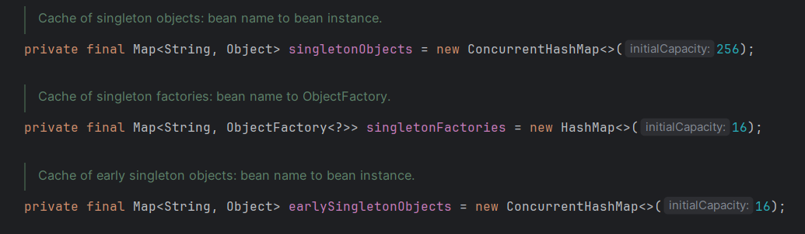
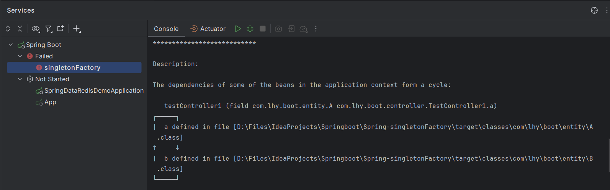

# Spring面试题 精简版

### 1. Spring两大核心

**IoC（Inversion of Control）和AOP（Aspect-Oriented Programming）**

*控制反转*（IoC，Inversion of Control）把传统上由程序代码直接操作的对象的调用权交给容器，通过容器来实现对象组件的装配和管理。

IoC负责创建对象，管理对象（通过DI），装配对象，配置对象，并管理这些对象的生命周期。

依赖注入（DI，Dependency Injection）是IoC的实现，具体为工厂方法模式+反射。

IoC有三种注入方式：
* 构造器注入
* setter方法注入
* 注解注入

*面向切面编程*（AOP，Aspect-Oriented Programming），用于将那些与业务无关，但却对多个对象产生影响的公共行为和逻辑，抽取并封装成一个名为切面（Aspect）的可重用模块。

Spring AOP使用动态代理（JDK -> 实现被增强类实现的接口、cglib -> 继承要被增强的类），AOP不会去修改字节码，而是每次运行时在内存中临时为方法生成一个AOP对象，这个AOP对象包含了目标对象的全部方法，并在特定切点做了增强处理，并回调原对象的方法。

### 2. Spring支持的Bean的作用域有几种

Spring支持以下5种作用域：

- singleton：默认作用域，单例bean。**创建时就加入IoC容器，有线程安全问题；**
- prototype：原型模式（多例）bean。**每次用到都复制一个新的实例，不加入IoC容器，不存在线程安全问题；**
- request：为每一个request创建一个bean实例，请求完成后直接失效并丢弃；
- session：同一个session会话共享一个bean实例，不同会话用不同实例；
- global-session(Application)：全局作用域，所有会话共享一个实例。

### 3. BeanFactory和ApplicationContext的区别

BeanFactory：Spring最顶层的接口，实现了Spring容器一些最基础的功能。

ApplicationContext：BeanFactory的子子接口，扩展了其功能：

* 国际化支持
* 事件监听
* 可以同时加载多个配置文件，等。

**BeanFactory实例化bean的方式：懒汉式，用到才实例化；**

**ApplicationContext实例化bean的方式：饿汉式，启动时就全部实例化。**

### 4. Spring框架中用到了哪些设计模式？

* 1. 工厂方法模式：BeanFactory，用于创建对象；
* 2. 单例模式、原型模式：Bean的作用域，默认是singleton；
* 3. 代理模式：AOP，用到了JDK动态代理和cglib字节码生成技术；
* 4. 模板方法模式：用于解决代码重复的问题。后缀是Template的都是模板；
* 5. 观察者模式：发布-订阅模式。如ApplicationListener。

### 5. Spring AOP通知类型

前置（before）、后置（after-returning）、异常（after-throwing）、环绕（around）、最终（after（finally））

### 6.Spring依赖注入都有哪几种方式

IoC有三种注入方式：
* 构造器注入
* setter方法注入
* 注解注入

### 7. Spring如何解决循环依赖？

循环依赖：A中包含B的引用，B中包含A的引用，A、B都是单例bean。
解决方法：使用三级缓存。



```java
package org.springframework.beans.factory.support;

public class DefaultSingletonBeanRegistry extends SimpleAliasRegistry implements SingletonBeanRegistry {
    ...
    private final Map<String, Object> singletonObjects = new ConcurrentHashMap<>(256);
    private final Map<String, Object> earlySingletonObjects = new ConcurrentHashMap<>(16);
    private final Map<String, ObjectFactory<?>> singletonFactories = new HashMap<>(16);
    ...
}
```
- 一级缓存：singletonObjects, ConcurrentHashMap<String, Object>

    保存所有已经创建完成的bean。

- 二级缓存：earlySingletonObjects, ConcurrentHashMap<String, Object>

    保存正常创建中的bean。（完成了实例化，但是属性还没有赋值）

- 三级缓存：singletonFactories, HashMap<String, ObjectFactory<?>>

    保存的是对象的工厂，通过工厂方法可以获取到目标对象。

步骤：
- 1.每次创建对象之前，Spring首先会从缓存中获取对象。但显然A还没有创建过，于是尝试创建A对象。

- 2.实例化A对象。首先将A标记为创建中，然后调用构造方法进行实例化，再把A放进一个ObjectFactory工厂里，保存这个工厂到三级缓存中。

- 3.A对象进行属性注入。这时候发现A的属性中含有B的引用，显然B也没创建过，于是先去创建B对象。

- 4.实例化B对象。与第2步相同，此时三级缓存中有两个ObjectFactory。

- 5.B对象进行属性注入。这时发现B中含有A的引用，于是去缓存中按照一二三级的顺序查找。最后在三级缓存中获得一个ObjectFactory，调用`ObjectFactory.getObject()`方法获得到了A对象。此时会把A对象从三级缓存中拿出来，放进二级缓存。

- 6.B对象完成创建。拿到A对象后，将A对象的引用赋值给B对象的属性，B对象完成了创建，放进一级缓存。

- 7.A对象在一级缓存中拿到B对象的引用，完成属性注入，进而完成创建，并加入一级缓存。

注意：
* 由于加入三级缓存的前提是对象可以通过构造方法创建，因此构造器循环依赖无法解决；



* 不支持原型（prototype）bean属性注入循环依赖。对于原型bean，只有在需要时才会实例化。

### 8. Spring Bean的生命周期

* 实例化 Instantiation
* 属性赋值 Populate
* 初始化 Initialization
* 使用
* 销毁 Destruction

### 9. Spring Bean的自动装配

Spring提供了向Bean中自动注入依赖的功能，这个过程就是自动装配。

自动装配有两种方式：
- 基于xml文件：autowire = byType, byName, constructor
- 基于注解：@Autowired @Resource

Spring注解开启方式：`<context:annotation-config/>` ?* 

1.*byType 根据类型*

在byType方式中，spring容器会基于反射查看bean定义的类，然后找到依赖类型相同的bean注入。这个过程需要使用setter注入，因此必须存在setter方法。

2.*byName 根据名称*

使用autowire=byName进行装配时，spring容器将会尝试将属性名和bean名称进行匹配，如果找到的话就注入到依赖中。

如果没有找到对应名称的bean，将不会向依赖中注入任何bean。

3.*constructor 根据构造器*

使用autowire=constructor时，spring容器同样会尝试找到那些类型与构造器相匹配的bean，然后注入。

4.*@Autowired*

默认按照类型进行装配。如果想要按照名称，可以配合@Qualifier("name")使用。

```java
public class UserServiceImpl implements UserService{
	// 使用Autowired标注成员变量
	@Autowired
	private UserDao userDao;

	@Autowired //使用autowired标注构造方法
	public UserServiceImpl(UserDao userDao){
		this.userDao=userDao;
	}
	@Autowired  //使用autowired标注set方法
	public void setUserDao(UserDao userDao){
		this.userDao=userDao;
	}
	@Override
	public void done(){
		userDao.done();
	}
}
```
通过将@Autowired注解修饰成员变量，成员方法，构造方法三种方式，将userDao依赖注入到UserServiceImpl中。实际更多使用标注成员变量的方式。

5.*@Resource*

默认按照名称进行装配。可以指定是按照name还是type进行装配。

### 10.Spring AOP的一些名词

- **横切关注点**

    跨越应用程序多个模块的方法或功能。
    即是与我们业务逻辑无关的，但是我们需要关注的部分，就是横切关注点。
    如日志、安全、缓存、事务等等。

- **连接点 Join point**

    在应用执行中能插入切面的点。
    即程序执行过程中能够应用通知的所有点（执行的方法）。

- **切点 Pointcut**

    是真正需要插入切面的一个或多个连接点。
    即通知被应用的具体位置。

- **通知 Advice**

    切面的工作被称为通知。
    即包含了需要用于多个应用对象的横切行为。

- **切面 Aspect**

    是通知和切点的结合。
    定义了切面：是什么，在何时和何处完成了功能。

- **织入 Weaving**

    织入是把切面应用到目标对象并创建新的代理对象的过程。
    切面在指定的连接点被织入到目标对象中。在目标对象的生命周期里有多个点可以进行织入:
    编译期 类加载期 运行期

- **引入 Introduction**

    指向现有类添加新方法或属性。

### 11. Spring事务的隔离级别

同MySQL。

- 读未提交
- 读已提交
- 可重复读
- 串行化

### 12. Spring事务的传播行为

解释：当一个事务方法被另一个事务方法调用时，这个事务方法应该如何进行。

例如：methodA事务方法调用methodB事务方法时，methodB是继续在调用者methodA的事务中运行呢，还是为自己开启一个新事务运行，这就是由methodB的事务传播行为决定的。

Spring定义了7种传播行为：

- PROPAGATION_REQUIRED

    如果存在一个事务，则支持当前事务。如果没有事务则开启一个新的事务。 

- PROPAGATION_SUPPORTS

    如果存在一个事务，支持当前事务。如果没有事务，则非事务地执行。
    
    表示当前方法不需要事务上下文，但是如果存在当前事务，那么该方法会在这个事务中运行。

- PROPAGATION_MANDATORY

    如果已经存在一个事务，支持当前事务。如果没有一个活动的事务，则抛出异常。

- PROPAGATION_REQUIRES_NEW

    它会开启一个新的事务。如果一个事务已经存在，则先将这个存在的事务挂起。

- PROPAGATION_NOT_SUPPORTED

    总是非事务地执行，并挂起任何存在的事务。

- PROPAGATION_NEVER

    总是非事务地执行，如果存在一个活动事务，则抛出异常。

- PROPAGATION_NESTED

    如果一个活动的事务存在，则运行在一个嵌套的事务中。 如果没有活动事务, 则按TransactionDefinition.PROPAGATION_REQUIRED 属性执行。 

PROPAGATION_REQUIRES_NEW 和 PROPAGATION_NESTED 的最大区别在于:

PROPAGATION_REQUIRES_NEW 完全是一个新的事务, 而 PROPAGATION_NESTED 则是外部事务的子事务, 如果外部事务 commit, 嵌套事务也会被 commit, 这个规则同样适用于 roll back。

