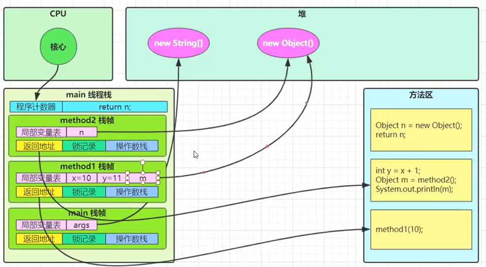

# JUC并发编程

## 1. 进程与线程

### 1.1 进程 Progress

**进程是操作系统中资源分配的基本单位，可以看成是线程的容器。**

- *主要作用：加载指令，管理内存，管理IO*

- 当一个程序被运行，从磁盘加载这个程序的代码到内存，这时就开启了一个进程。

- 进程可以视为程序的一个实例。**大部分程序可以同时运行多个实例。**

### 1.2 线程 Thread

**线程是操作系统中最小的调度单位。一个进程由多个线程组成。**

### 1.3 进程与线程对比

- 进程基本上相互独立，而线程是进程的一个子集。

- 进程拥有共享的资源（如内存空间），供其内部的线程共享。

- 进程之间的通信较为复杂

    同一台计算机的进程通信称为IPC（Inter-process communication）
    不同计算机之间的进程通信，需要通过网络，共同遵守相同的协议。（HTTP）

- 线程通信相对简单，因为它们共享进程内的内存。

- 线程更轻量级，线程之间切换（上下文切换）成本一般比进程间切换低。

## 2. 并行和并发

### 2.1 并行 Parallel - 同一时间动手做多件事的能力

*硬性条件：多核心CPU才能并行*

**多个线程同时运行。**

### 2.2 并发 Concurrent - 同一时间应对多件事情的能力

**一个CPU核心 通过时间片轮转 轮流服务多个线程**

微观上是串行，宏观感觉上是并行。

    超线程（Hyper Thread）技术：一个CPU核心可以同时执行两个线程。

### 2.3 应用

1) 异步调用

从方法调用的角度来讲，如果

* 需要等待结果返回，才能继续运行 -- 同步
* 不需要等待结果返回，就能继续运行 -- 异步

同步还有另外的意思：**让多个线程步调一致。**

2) 提高效率

- tomcat异步servlet，让用户线程处理耗时较长的操作，避免阻塞tomcat工作线程
- ui/ux编程中，新开线程处理耗时操作避免阻塞ui主线程

**注意：**

1.单核CPU，多线程编程并不能实际提高程序运行效率，只是为了能在不同的任务之间切换。

    切换线程运行的过程称为：上下文切换，耗时耗资源

2.多核CPU可以并行跑多个线程，但也不一定能提高程序的运行效率。

3.IO操作不占用CPU，我们一般拷贝文件使用的是【阻塞IO】，这时虽然线程不用cpu，但是要等IO结束，没能充分利用线程。所以后面才有【非阻塞IO】和【异步IO】。

## 3. Java线程

### 3.1 创建和运行线程

<h4>方法一，直接使用Thread</h4>

```java
//有名线程
Thread t = new Thread(["名字"]) {
    @Override
    public void run() {
        //To-Do
    }
};
//启动线程
t.start();

//直接新建并启动匿名线程
new Thread(() -> {
    //To-Do lambda表达式
}).start();
```

<h4>方法二，使用Runnable配合Thread</h4>

```java
Runnable runnable = new Runnable() {
    @Override
    public void run() {
        //TO-DO
    }
};

Thread t = new Thread(runnable);
t.start();
```

- 方法一 把线程和任务合并在一起
- 方法二 把线程和任务分开了
- 用Runnable更容易与线程池等高级API配合
- 用Runnable让任务脱离了Thread继承体系，满足依赖倒置原则，更灵活

<h4>方法三，FutureTask配合Thread</h4>

FutureTask能够接收Callable类型的参数，用来处理有返回结果的情况。

```java
Module java.base; ⬇
package java.util.concurrent; ⬇
public class FutureTask<V> implements RunnableFuture<T>; ⬇
public interface RunnableFuture<V> extends Runnable, Future<V>;

@FunctionalInterface
public interface Callable<V> {
    V call() throws Exception;
}
```

Future<V>接口有一个`V get()`方法，能够返回执行的结果。

```java
FutureTask<Integer> task = new FutureTask<>(new Callable<Integer>() {
    @Override
    public Integer call() throws Exception {
        log.debug("running");
        Thread.sleep(2000);
        return 100;
    }
});

Thread t1 = new Thread(task, "t1");
t1.start();

log.debug("{}", task.get());
```

### 3.2 查看进程线程的方法

PID：进程编号 

PPID：父进程（创建和控制这一进程的进程）编号

<h4>Windows</h4>

- 任务管理器
- tasklist 查看进程 

    筛选：使用管道符 + findstr [ 关键字 ]
    如：tasklist | findstr java

- taskkill 杀死进程

    taskkill /f /pid < PID >
    /f -> force，强制杀死

<h4>Linux</h4>

- ps -ef 查看所有进程

    筛选：管道符 + grep [ 关键字 ]
    如：ps -ef | grep java

- ps -Tf -p < PID > 
- kill < PID > 杀死进程
- top 命令

    参数：-H：查看线程 -p < pid >

<h4>Java</h4>

- jps 查看所有Java进程
- jstack < PID > 查看某一时刻某个Java进程（PID）的所有线程状态
- jconsole 查看某个Java进程中线程的运行情况（图形界面）

### 3.3 线程运行的原理

<h4>栈与栈帧</h4>

**JVM内存结构：虚拟机栈**

**每个线程启动后，JVM都会为其分配一块栈内存。栈内存线程私有。**

- 每个栈由多个**栈帧（Frames）**组成，对应着每次方法调用时所占用的内存。
- 每个线程只能有一个活动栈帧，对应着当前正在执行的方法。
- 方法执行完毕后栈内存自动释放。

栈帧：存储局部变量（局部变量表）、方法参数、返回地址、锁记录、操作数栈等



<h4>线程上下文切换（Thread Context Switch）</h4>

因为以下几种原因之一，导致cpu不再执行当前线程，转而执行另一个线程：

* （时间片到）线程的cpu时间片用完；
* 垃圾回收（STW）；
* （高优先级抢占）有更高优先级的线程需要运行；
* （阻塞/放权）线程自己调用了sleep、yield、wait、join、park、synchronized、lock等方法。

当上下文交换发生时，OS会保存当前线程的状态，**使用线程控制块TCB中的现场保护区**，并恢复另一个线程的运行状态，Java中对应的概念就是PC（程序计数器）。

保存的信息包括：

    PC、局部变量、操作数栈、返回地址等

*上下文切换频繁发生会影响性能。*

### 3.4 Thread类常见方法

|方法名|static|功能说明|注意|
|----|----|----|----|
|start()|----|启动一个新的线程，在新线程中运行run()方法中的代码|start()方法只是让线程进入就绪状态，而非立即运行。start()方法只能调用一次。|
|run()|----|新线程启动后调用的方法|如果在构造Thread对象时传递了Runnable参数，则线程启动后会调用Runnable中的run()方法。|
|join()|----|等待线程运行结束|主要用于线程通信|
|join(long n)|----|等待线程运行结束，最多等待n毫秒|----|
|getId()|----|获取线程长整型的Id|Id唯一|
|getName()|----|获取线程名|----|
|setName(String name)|----|设置线程名|----|
|getPriority()|----|获取线程优先级|----|
|setPriority(int)|----|设置线程优先级|java中规定的线程优先级是1-10的整数，较大的优先级能提高该线程被CPU调度的几率|
|getState()|----|获取线程状态|线程有6大状态，用Enum表示：NEW（刚创建，还未运行）、RUNNABLE（就绪/运行）、BLOCKED（阻塞）、WAITING（等待）、TIMED_WAITING（）、TERMINATED（已停止）|
|isInterrupted()|----|判断是否被打断|不会清除打断标记|
|isAlive()|----|线程是否存活|----|
|interrupt()|----|打断线程|如果被打断线程正在sleep，wait，join，会导致被打断的线程抛出InterruptedException，并清除打断标记；如果打断的正在运行的线程，则会设置打断标记；park中的线程被打断，也会设置打断标记|
|interrupted()|static|判断当前线程是否被打断|会清除打断标记|
|currentThread()|static|获取当前正在执行的线程|----|
|sleep(long n)|static|让当前线程休眠n毫秒，休眠时让出cpu时间片给其他线程|----|
|yield()|static|提示线程调度器让出当前线程对于CPU的使用|主要是为了测试和调试|

#### start()和run()

若有以下代码：
```java
@Slf4j(topic = "c.Test")
public class Test {
    public static void main(String[] args) {
        Thread t1 = new Thread("t1") {
            @Override
            public void run() {
                log.debug("running");
            }
        }
    };

    t1.run();
}
```
main方法中直接调用run()方法，其实没有开启新的线程，是在主线程执行了run()方法。

只有调用了start()方法，t1线程才会被启动。

启动后，该线程进入 **RUNNABLE** 状态。

#### sleep() - 睡眠，睡眠时让出cpu，运行 -> 阻塞

- 调用此方法会让当前线程**从Running进入TIMED_WAITING状态**；
- 其他线程可以使用interrupt()方法打断（叫醒）正在睡眠的线程，这是sleep方法会抛出InterruptException；
- 睡眠结束后的线程未必会立即得到执行（cpu没有分配时间片）；
- 建议用TimeUnit的sleep代替Thread的sleep来获得更好的可读性。

    TimeUnit.SECONDS.sleep(long timeout);

#### yield() - 主动让出cpu，运行 -> 就绪

- 调用yield()方法会让当前线程**从Running进入RUNNABLE状态**；
- 具体的实现依赖于操作系统的任务调度管理。

<h4>线程优先级 setPriority(int priority)</h4>

```java
package java.lang;
public class Thread implements Runnable {
    ...
    public static final int MIN_PRIORITY = 1; //最小优先级
    public static final int NORM_PRUORITY = 5; //默认优先级
    public static final int MAX_PRIORITY = 10; //最大优先级
    ...
}
```
yield()方法与setPriority(int priority)差不多，调用后都是线程获得的时间片变多了或是变少了。

不过需要注意：
* 线程优先级提示，仅仅是一个提示，**调度器可以忽略它**；
* 如果cpu较忙，优先级更高的线程会获得更多时间片，但cpu空闲时，优先级几乎没作用。

#### *join() - 哪个线程调用join，就是等待哪个线程结束

```java
package java.lang;
public class Thread implements Runnable {
    ...
    public final synchronized void join(final long millis) 
        throws InterruptedException {
        if(millis > 0) {
            if(isAlive()) {
                final long startTime = System.nanoTime();
                long delay = millis;
                //do-while循环，一直等待delay毫秒；
                //结束条件与运算：
                //1.线程存活；2.delay的剩余时长 > 0；
                //两个条件中有一个不满足则退出循环。
                do {
                    wait(delay);
                } while (isAlive() && (delay = millis - 
                    TimeUnit.NANOSECONDS.toMillis(System.nanoTime() - startTime)) > 0)
            }
        } else if (millis == 0) {
            //若是join(0)，则等待到线程运行结束。
            while(isAlive()) {
                wait(0);
            }
        } else {
            throw new IllegalArgumentException("timeout value is negative");
        }
    }
    public final synchronized void join() throws InterruptedException {
        join(0);
    }
    public final synchronized void join(long millis, int nanos)
        throws InterruptedException {
        
        //前两个判断：输入参数非法，抛出异常
        if (millis < 0) {
            throw new IllegalArgumentException("timeout value is negative");
        }
        if (nanos < 0 || nanos > 999999) {
            throw new IllegalArgumentException(
                                "nanosecond timeout value out of range");
        }

        //如果nanos参数在范围内且等待毫秒数未超过上限，则多等待1毫秒
        if (nanos > 0 && millis < Long.MAX_VALUE) {
            millis++;
        }

        join(millis);
    }
    ...
}
```

参数列表：
- (final) long millis：等待的毫秒数，最大值是2的63次方-1
- int nanos：额外等待的纳秒数，取值范围是[0,999999]

百度面试题：**三个线程t1、t2、t3，让t1、t2都执行完，t3再执行**

**解决方案（之一）：t2中调用t1.join()，t3中调用t2.join()。**

#### wait() - 等待，继承自Object类，本地方法

```java
package java.lang;
public class Object {
    ...
    public final void wait() throws InterruptedException {
        wait(0L);
    }
    public final native void wait(long timeoutMillis)
        throws InterruptedException; 
}
```

API note：

**导致当前线程等待，直到它被唤醒（通常是通过通知或中断），或者直到一定数量的实时时间已经过去。**

#### interrupt() - 打断（叫醒）

### 3.5 Java线程的状态：5种

**1. New - 刚被创建，还没启动**

可以到达的状态：
- 通过`start()`方法，到达*Runnable*（就绪状态）。

**2.Runnable - 就绪**

可以到达的状态:
- 获得CPU时间片，到达*Running*（运行中状态）。

**3.Running - 运行中**

可以到达的状态：
- 主动调用`yield()`方法，到达*Runnable*（就绪状态）；
- CPU时间片用完，到达*Runnable*（就绪状态）；
- （主动）调用`join()`、`sleep()`，到达*Blocked1*（1.等待阻塞）；
- 主动调用`wait()`方法，到达*Blocked1*（1.等待阻塞）；
- 遇到`synchronized`同步锁，到达*Blocked2*（2.同步阻塞）；
- 线程执行正常结束或异常退出，到达*Dead*（死亡状态）。

**4.Blocked - 阻塞**

*1. 等待阻塞，通过`join()`或是`sleep()`到达*

- join()结束或是sleep()结束，到达*Runnable*（就绪状态）；
- I/O结束，到达*Runnable*（就绪状态）。

*2. 等待阻塞，通过`wait()`到达*

- 通过其他线程调用`notify()/notifyAll()/interrupt()`方法唤醒，到达同步阻塞状态。

*3. 同步阻塞*

- 获取到同步锁（临界资源），进入*Runnable*（就绪状态）。

**5.Dead - 死亡**


