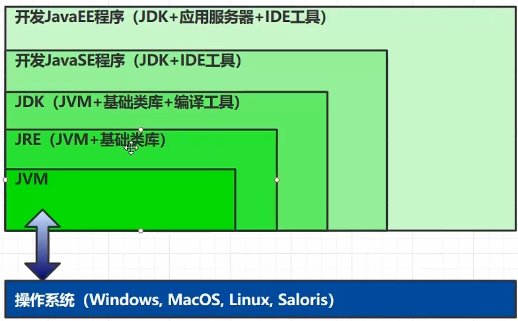
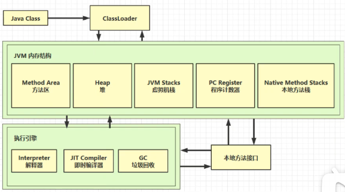

# JVM - Java Virtual Machine

## 什么是JVM
  JVM - Java虚拟机，Java程序（Java二进制字节码）的运行环境
## JVM好处
  1.一次编写，处处运行 
  
   JVM通过一套JVM指令集屏蔽了字节码与底层OS之间的差异 只要有JVM，Java字节码就可以运行

  2.自动内存管理，垃圾回收功能

  3.数组下标越界检查

  4.多态

   JVM使用虚方法表实现了多态

## 比较

### JVM JRE JDK

JRE - Java Runtime Environment Java运行时环境

JDK - Java Development Kit Java开发工具包

JVM - Java虚拟机（运行环境，空壳）

基础类库 - java.base

编译工具 - javac等工具

## 学习路线

    Java字节码 -> 类加载器 -> JVM
    
    类放在Method Area（方法区中）
    类创建的实例、对象放在Heap（堆）里
    
    堆中的对象调用方法时用到JVM Stacks（虚拟机栈）、PC Register（程序计数器）、Native Method Stacks（本地方法栈）

    方法执行时由执行引擎中的Interpreter（解释器）逐行执行
    方法中被频繁调用的代码被JIT Compiler（即时编译器）优化执行
    GC（垃圾回收）会对堆中不再被引用的对象进行回收

