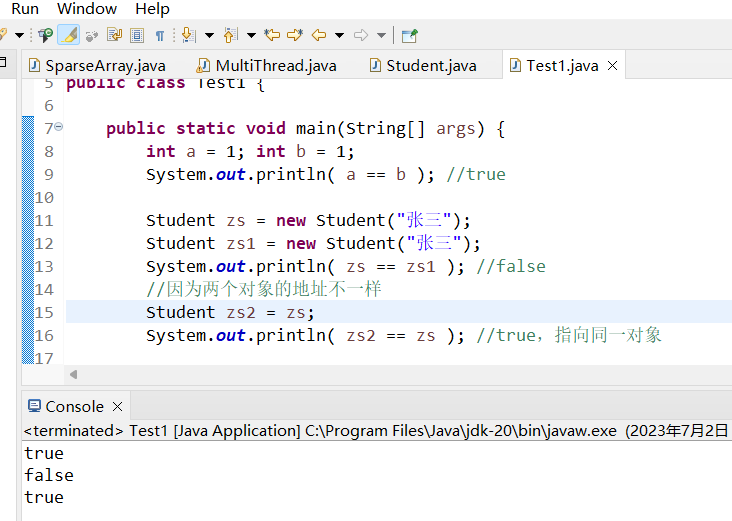

# equals() 与 双等号(==) 的区别

**Object类的equals(Object)方法在没有被子类重写的情况下，与==等价。**

对于双等号(==)，
    
    如果比较的是基本数据类型，则比较 *值* ;
    如果比较的是引用数据类型，则比较 *地址* ，即判断两个引用是否指向同一个对象。例如：
    int a = 1; int b = 1;
    System.out.println( a == b ); //true

    Student zs = new Student("张三");
    Student zs1 = new Student("张三");
    System.out.println( zs == zs1 ); //false
    //因为两个对象的地址不一样
    Student zs2 = zs;
    System.out.println( zs2 == zs ); //true，指向同一对象

 对于equals()方法，**一般在自定义的类中重写此方法，好来判断对象内部的属性是否相等。** 重写了此方法的类：

    java.lang.String
    java.lang.Integer等基本数据类型包装类
    ..

特别注意，*equals()方法不能比较基本数据类型。*

在使用时注意避免空指针异常。

    1.一般格式为 常量.equals(变量)
    2.若是两个对象都可能为null，就用工具包中的equals(Object,Object)方法：
        Java SE 15 & JDK 15 API
            java.util.Objects
        public static boolean equals(Object a, Object b)
        如果a与b相等，则返回true；
        如果都为null，则返回true；如果第一个参数不为空，则通过使用该方法的第二个参数调用第一个参数的equals方法来确定相等性。

        
Object类文档中对于方法equals()的定义：

    Java SE 15 & JDK 15 API
        java.lang.Object
    public boolean equals(Object obj)
    表明某些其他的对象与这个对象“相等”。

    equals方法在非null对象引用上实现等价关系（离散数学）：

    自反性：对于任何非空的引用值x，x.equals(x)应该返回true；
    对称性：对于任何非空引用值x和y，x.equals(y)应该返回true当且仅当y.equals(x)返回true；
    传递性：对于任何非空引用值x，y和z，如果x.equals(y)返回true且y.equals(z)返回true，那么x.equals(z)应该返回true；
    一致性：对于任何非空引用值x和y ，多次调用x.equals(y)始终返回true或始终返回false ，前提是未修改对象上的equals比较中使用的信息。
    对于任何非空的参考值x，x.equals(null)应该返回false。
    
    类Object的equals方法实现了对象上最具区别的可能等价关系; 也就是说，对于任何非空引用值x和y ，当且仅当x和y引用同一对象（ x == y 返回true ）时，此方法返回true 。

    请注意，通常需要在重写此方法时一并重写hashCode方法，以便维护hashCode方法的常规协定，该方法声明相等对象必须具有相等的哈希代码。

    参数
    obj - 要与之比较的参考对象。
    结果
    true如果此对象与obj参数相同; 否则为false 。