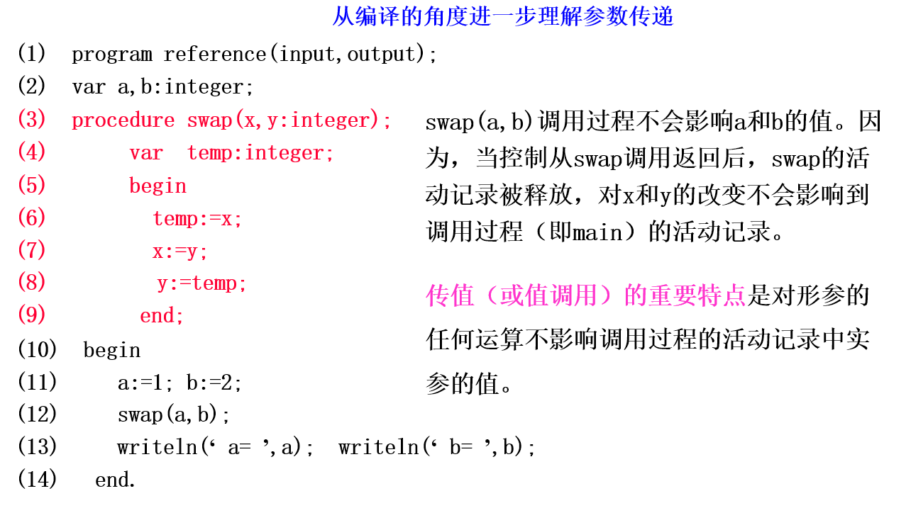

# Java参数传递

## 一般情况下参数传递的方式

### 1.传值（Call-by-value）

    1.形参当作过程中的局部变量处理，即在被调过程的活动记录中开辟形参的存储空间（形式单元）；
    2.调用过程计算实参的值，并将其放在形式单元中；
    3.被调用过程像使用局部变量一样使用这些形式单元。

### 2.传地址（Call-by-reference）

也称引用调用。调用过程传给被调过程的是指针，指向实参存储位置的指针。

    1.如果实参是一个名字或是具有左值的表达式，则左值本身传递过去；
    2.如果实参是一表达式而没有左值（如a+b，2），则表达式先求值，并存入某一位置，然后该位置的地址传递过去；
    3.被调用过程中对形式参数的任何引用和赋值都通过传递到被调过程的指针被处理成间接访问。

**上述两种传递方式的本质区别**

*对形参的修改不会影响到实参，就是值传递。*

## Java中只有值传递。

在JVM中，*用new关键字创建的对象*存放在 **堆（Heap）** 中；

*基本数据类型*、*局部变量*以及*对象的引用*存放在 **虚拟机栈（Stack）** 中。

 传递基本数据类型时，**是将数据创建了一个副本**传递到方法中 

引用数据类型（对象），由于对象存放在堆中，我们拿到的其实是这个**对象的引用**。通过对象的引用就可以操作对象。

*可以将引用理解为遥控器，通过遥控器操作对象（电视机）*

    如：
    Student stu = new Student(); //对象stu存放在堆中
    stu.getName();  //这里的stu其实是真正对象的引用

传递对象时，其实是**将这个对象的引用创建了一个副本**传递到方法中，此时形参和实参相当于两个遥控器，但*都指向了堆内存中同一个对象*。

    Student stu = new Student("李四"); //对象的引用，实参
    System.out.println(stu.getName()); //打印出李四
    method(stu); //引用的副本作为参数传递进方法
    ..
    public void method(Student s) { //s为形参
        stu.setName("张三");
    }
    ..
    System.out.println(stu.getName()); //打印出张三

通过形参引用操作对象时，显得实参好像改变了。

*但是实参本身是没有改变的，因为实参本身也只是一个引用（遥控器）。* 

*电视机内容改变了，但遥控器本身还是那个遥控器。*

## 总结

如果是基本数据类型，那就是**复制一份值传递给形参**

如果是引用数据类型，那就**将引用复制一份传递给形参**

形参始终拿到的都是一个*副本*，无论如何都无法通过形参改变实参。