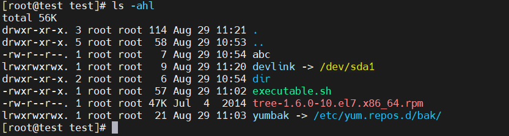
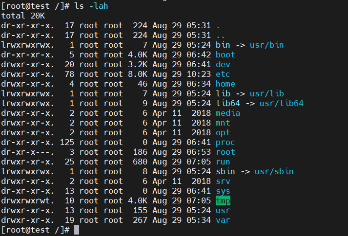

# Linux文件系统

## 文件名颜色的含义

使用ls命令查看文件时，命令行会根据不同的文件类型输出不同的颜色。

参数说明：`ls -ahl`

- -a = --all 所有类型文件
- -h = --human 人可读，把文件大小写成K、M、G等
- -l (long)长列表信息

|颜色|说明|
|---|---|
|正蓝色|目录|
|白色|普通文件|
|绿色|可执行文件|
|红色|压缩文件|
|浅蓝色|链接文件|
|黄色|设备文件|
|绿底|目录，且权限为其他人并拥有写权限|
|灰色|其他文件|

## 目录结构

使用以下命令进入根目录：

    cd /

|文件|类型|说明|
|--|--|--|
|bin(ary)|软链接，链接到/usr/bin|存放系统命令的目录|
|boot|目录|系统启动目录，保存如内核文件和启动引导程序等|
|dev(ice)|目录|保存设备文件|
|etc(etera)|目录|保存配置文件，默认使用rpm安装的应用的配置文件都在这|
|home|目录|普通用户家目录，普通用户`cd ~`就到这|
|lib(rary)|软链接，链接到/usr/lib|保存系统调用的函数库|
|lib64|软链接，链接到/usr/lib64|64位系统调用函数库|
|media|目录|挂载光盘的目录|
|mnt(mount)|目录|挂载目录|
|opt|目录|第三方安装软件保存的位置|
|proc(esses)|虚拟文件系统（大小为0）|主要保存进程状态，系统内核等，存储在内存，重启后消失（重置）|
|root|目录|超级用户的家目录，超级用户`cd ~`到这|
|run|目录|用于存储系统运行时的临时文件和只在该时段可用的文件，例如进程ID文件和锁文件|
|sbin|软链接，链接到/usr/sbin|存放系统命令的目录，只有超级用户可以执行|
|srv(service)|目录|服务数据目录|
|sys|虚拟文件系统|主要保存内核信息|
|tmp(temp)|临时目录|保存临时文件|
|usr(unix shared resources)|目录|系统软件资源目录|
|var|目录|动态数据保存位置。主要保存缓存，日志及软件运行产生的文件|

