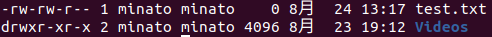

# Linux常用命令

环境：Ubuntu 20.04 LTS / CentOS 8 Stream

## Linux命令的基本格式

    command 参数1 参数2 ...

*命令区分大小写。*

## 常用基本命令

|解释|命令|举例|
|----|----|----|
|帮助|man|man date|
|查看日期|date|date|
|显示日历|cal|cal 1998|
|显示大字|banner|banner "ABCD"|
|计算器|bc|bc|
|修改密码|passwd|passwd|
|查看谁在使用|who|who|
|清除屏幕|clear|clear|

### 注销

    $ exit 或 直接按键Ctrl+d

### 切换超级用户

    $ su

*Ubuntu20.04 LTS系统第一次进入root用户需要设置密码。*

    $ sudo passwd root

退出root用户：

    # exit

## Linux文件系统

Linux操作系统的文件系统分为两大类：
- 根文件系统 the root file system
- 附加文件系统

### 文件类型

- 一般文件 ordinary

    文本文件 二进制文件

- 目录文件 directory
- 特殊文件 special
- 符号链接文件 symbolic links

|符号|文件类型|
|---|------|
|-|普通文件（Regular file）|
|d|目录文件（directory）|
|b|块设备文件（block device）|
|c|字符设备文件（character）|
|p|管道设备（FIFO）|
|l|符号链接文件（Symbol link）|
|s|套接字（socket）|

例如：

### 切换路径

    $ cd [相对路径][绝对路径]

根目录和用户目录：

    $ cd / 切换到根目录
    $ cd ~ 切换到用户目录 相当于 cd /home/minato

切换到当前/上级目录：

    $ cd . 切换到当前目录
    $ cd .. 切换到当前项目的父目录

## 文件存取权限

|权限|普通文件的存取权限|目录的存取权限|权重数|
|----|----|----|----|
|r|可读|可读文件名|4|
|w|可写|能建立和删除文件，可以改变文件名|2|
|x|可执行|能使用该目录下的文件(如cd命令)搜索文件|1|

有三种类型的用户可以存取文件：

- owner

    文件的拥有者。

- group

    文件所在的工作组。

- other

    其他用户。

每种类型的用户都有rwx三种存取权限。

|权限数|效果|
|---|---|
|7|rwx|
|6|rw-|
|5|r-x|
|4|r--|
|3|-wx|
|2|-w-|
|1|--x|
|0|---|

### 修改存取权限

    $ chmod [用户类型=权限] [文件名] 
    例如
    chmod u=rwx,g=rx,o=rx abc.txt

    $ chmod [权限数] [文件名]
    例如
    chmod 755 abc.txt

    $ chmod [用户类型][+/-][权限] [文件名]
    例如
    chmod u-x, g+w abc

*对于abc文件，去除 用户执行 的权限，加入 组可写 的权限。*

    $ chmod a[+/-][权限] [文件名]
    例如
    chmod a+r abc

*对于abc文件，给所有用户添加读的权限。*

### Linux文件系统常用命令

|解释|命令|举例|
|----|----|----|
|显示当前目录|pwd|pwd|
|改变目录|cd|cd /usr|
|进入/home|cd|cd|
|创建目录|mkdir|mkdir abc|
|删除空目录|rmdir|rmdir abc|
|删除目录及其内容|rm -r|rm -r abc|
|显示目录内容|ls|ls -l(文件长列表)|
||ls|ls -a(所有类型文件)|
|显示文本文件内容|cat|cat test1.c|
|分屏显示文本内容|more|more test2.c|
|拷贝文件|cp|cp file1 file2|
|移动（重命名）文件|mv|mv test1.c abc.txt|
|删除文件|rm|rm abc.txt|
|更改文件所有者|chown|chown root /u|
|更改文件权限|chmod|chmod 755 test.txt|
|查看文件树状结构|tree|tree [directory]|

## 安装软件包

### RPM - Red Hat Package Manager

    *Red Hat, CentOS, Fedora等可以直接使用*

Debian、Ubuntu需要使用apt命令安装rpm：

    sudo apt-get install rpm

基本用法：`rpm [options] [package_file]`

|选项|说明|
|---|---|
|-i,--install|安装一个包|
|-v|显示详细信息|
|-h|打印#，显示安装进度|
|-U,--update|升级一个包|
|-e,--erase|卸载一个包|
|-q,--query|查询一个包|
|-V,--verify|校验一个包|

### yum/dnf

- YUM - Yellowdog Updater Modified
- DNF - Dandified Yum

    *Red Hat, CentOS, Fedora等可以直接使用*

Debian、Ubuntu需要使用apt命令安装dnf：

    sudo apt-get install dnf

基本用法：`dnf/yum [options] [command] [package ...]`

### apt

Debian、Ubuntu中默认使用。

*apt更新软件包需要sudo权限。*

基本用法：`apt [options] [command]`

## 系统管理

|解释|命令|举例|
|----|----|----|
|显示系统资源使用情况|top|top|
|列出当前进程信息快照|ps|ps -aux|
|终止运行的进程（发送SIGTERM信号）|kill|kill [pid]|
|显示磁盘空间使用情况|df|df -h|
|显示目录空间使用情况|du|du -h|

## 网络通信

|解释|命令|举例|
|----|----|----|
|测试连接|ping|ping baidu.com|
|查看网络状态|ifconfig|ifconfig|
||ip address|ip a|
|显示网络连接，路由和接口信息|netstat|netstat -4|
|远程连接到主机|ssh|ssh [user@host]|
|复制文件到其他主机|scp|scp [file] [user]@host:[path]|

禁止外部主机ping本机：

    iptables -I INPUT -p icmp --icmp-type 8 -j DROP

*ping的原理：发送icmp包*

## 管道符 |

**管道符前的命令的标准输出结果作为管道符后命令的标准输入（参数）。**

例如：查看本机的ip地址

    ifconfig | grep inet
    ip addr | grep inet

*管道符可以连续使用。*

## vi/vim编辑器

vim.org说，vim是一个开发工具。

共分为三种模式。

- 命令模式(Command mode)
- 输入模式(Insert mode)
- 命令行模式(Command-Line mode)

*输入':'即为命令行模式。*

重要命令：

|命令|解释|
|---|---|
|:w|保存|
|:q|退出编辑器|
|:q|不保存退出|
|:e f|打开文件f|
|:%s/x/y/g|'y'全局替换'x'|
|i|进入输入模式|
|esc|进入命令模式|
|u|undo|
|ctrl+r|redo|
|G|移动到这个档案的最后一行|
|nG|移动到第n行|
|gg|移动到第一行|
|yy|复制游标所在的那一行|
|nyy|从游标处那一行向下复制n行|
|p,P|p：在游标下一行粘贴；P：在游标上一行粘贴|
|/word|从光标处向下查找word|
|?word|从光标处向上查找word|
|n|重复前一个搜索动作|
|N|反向进行前一个搜索动作|
|:set nu|显示行号|
|:set nonu|不显示行号|

## 命令行操作技巧

- Tab 
- ctrl+c 取消输入，取消批处理
- ctrl+w 删除一串连续的字符 

