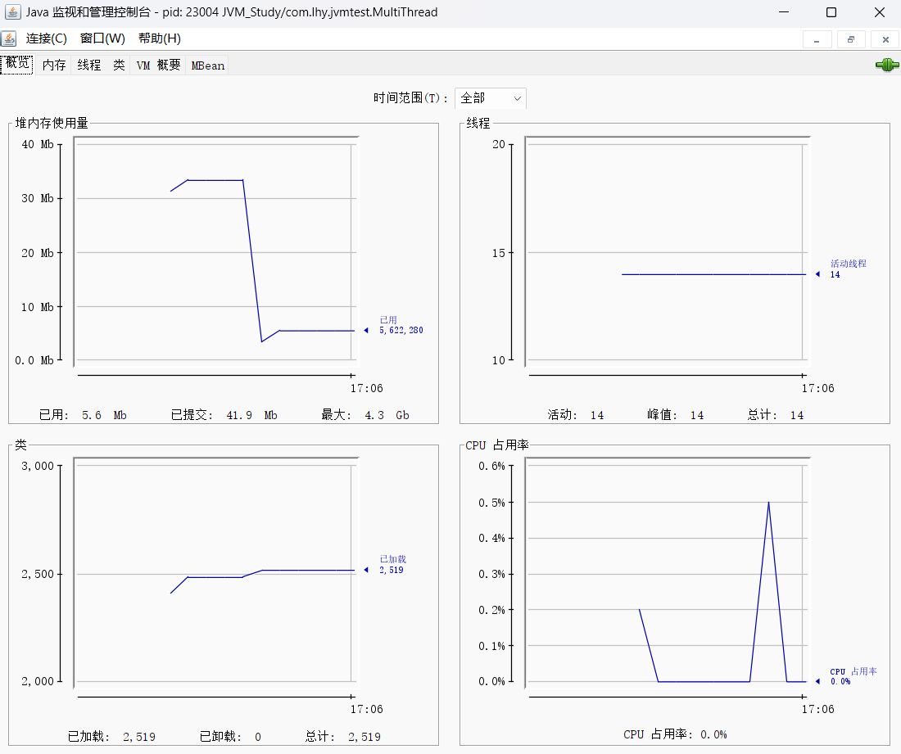

# JVM内存结构

    1.PC Register 程序计数器
    2.JVM Stacks 虚拟机栈
    3.Native Method Stack 本地方法栈
    4.Heap 堆
    5.Method Area 方法区

## 1.程序计数器 - Program Counter Register(寄存器)

**作用：记住下一条JVM指令的执行地址**

    PC是Java对物理硬件的屏蔽和抽象 
    PC在物理上通过寄存器实现

特点： 
    
    1.线程私有 - 一个PC属于一个线程
    2.不存在内存溢出（Java中唯一）

## 2.虚拟机栈 - JVM Stacks

    栈 - 后进先出 线性结构
    **虚拟机栈 - 每个线程运行需要的内存空间**
    栈帧 - 栈内元素
    虚拟机栈栈帧 - 每个方法调用时需要的内存

**每个线程只能有一个活动帧栈**，对应着当前正在执行的方法，**在本线程JVM栈栈顶**

### 问题分析

    Q1.垃圾回收是否涉及栈内存
    A1:不涉及。JVM GC机制只回收堆内存中不再被引用的对象，而栈内存中是一次次方法调用所产生的内存，其随着方法结束调用而自动释放。

    Q2.栈内存分配越大越好吗
    A2.不是。栈内存（线程运行时需要的内存）分配越大线程数量越少（物理内存大小一定）。

    Q3.方法内局部变量是否线程安全
    A3.安全。因为局部变量线程私有。若是类似static共享变量 则需要考虑线程安全。
    若是变量引用了对象并逃离了方法的作用范围（作为参数传入或是作为返回值返回）就不再线程安全。

### 栈内存溢出

有几种情况

    1.栈帧过多导致栈内存溢出（典型为递归调用）
    2.栈帧过大导致栈内存溢出（不容易出现）

**抛出异常 - java.lang.StackOverflowError**

### 线程诊断

案例1：cpu占用过多

    Linux下
    1.先用top定位哪个进程对cpu占用高
    2.ps H -eo [pid,tid,%cpu] | grep [pid]
    3.jstack 进程id（JVM的工具）返回线程的HEX编号，进一步定位到问题代码的源码行数

案例2：程序运行很长时间没有结果（线程死锁）

## 3.本地方法栈 - Native Method Stacks

**JVM在调用本地方法时 给这些方法提供的内存空间**

    本地方法 - 不是由Java代码编写的方法
    如使用C/C++编写的访问操作系统的方法
    java.lang.Object中的
    public native int hashCode()方法

## 4.堆 - Heap

**通过new创建的对象都会使用堆内存**

特点

    1.线程共享，需要考虑线程安全
    2.有GC（垃圾回收）机制

### 堆内存溢出

**抛出错误 - java.lang.OutOfMemoryError: Java heap space**

### 堆内存诊断

    1.jps工具 - 查看当前系统中有哪些Java进程
        jps返回进程pid和进程名
    2.jmap工具 - 查看堆内存占用情况
        jmap -heap [pid]
    3.jconsole工具 - 图形界面多功能监测工具

## 5.方法区 - Method Area

JVM规范中对方法区的定义：

    1.是所有Java虚拟机线程共享的区域，存储了与类结构相关的信息（成员方法，构造器，成员变量，运行时常量池等）
    2.方法区在虚拟机启动时被创建，逻辑上是堆的组成部分（不同JVM厂商实现逻辑不同）
    3.方法区也会导致内存溢出错误
        PermGen永久代
        Metaspace元空间 - 使用系统物理内存

### 方法区内存溢出

**JDK7以前** 永久代内存溢出，抛出

    java.lang.OutOfMemoryError: PermGen space

**JDK8之后** 元空间内存溢出，抛出

    java.lang.OutOfMemoryError: Metaspace

实际情况中 spring或mybatis中运用字节码的动态生成技术，会产生大量的类，使用不当容易造成方法区内存溢出

### 运行时常量池 - Runtime Constant Pool

**Java二进制字节码 *.class文件*** 包括

    类基本信息 常量池 类方法定义（包含虚拟机指令）

**常量池** 保存在*.class文件中 就是一张表，虚拟机指令根据这张常量表找到要执行的类名、方法名、参数类型、字面量等信息

**运行时常量池** 当该类被加载，该类的常量池信息就会放入运行时常量池中，并把里面的符号地址变成真实物理地址

### StringTable 串池 - hashtable结构，不能扩容
下面是一个例子：

    public class Test5 {
        public static void main(String[] args) {
            String s1 = "a";
            String s2 = "b";
            String s3 = "ab";
            String s4 = s1 + s2;

            System.out.println( s3 == s4); //false
        }
    }

打开Terminal，使用javap -v Test5.class反编译字节码文件，找到常量池和本地变量表：

**常量池Constant Pool**

**本地变量表LocalVariableTable**

反编译后的主方法中：

其中为Java字节码，部分代码含义如下：
<table>
    <tr> 
        <th colspan="3">上图部分代码含义</th>
    </tr>
    <tr>
        <td>代码</td>
        <td>含义</td>
        <td>备注</td>
    </tr>
    <tr>
        <td>ldc</td>
        <td>根据后面的编号（如#7）到常量池中查找并加载信息</td>
        <td>信息可以是常量或是对象的引用等</td>
    </tr>
    <tr>
        <td>astore_1</td>
        <td>把加载好的信息存入Slot为1的局部变量，保存到表中</td>
        <td></td>
    </tr>
    <tr>
        <td>aload_1</td>
        <td>从局部变量表中加载Slot为1的变量</td>
        <td></td>
    </tr>
    <tr>
        <td>invokedynamic</td>
        <td>调用动态方法</td>
        <td></td>
    </tr>
    <tr>
        <td>getstatic</td>
        <td>获得静态方法</td>
        <td></td>
    </tr>
</table>

    本机Java环境为JDK 15.0.2
    在JDK 9之前，使用运算符"+"合并字符串变量，底层使用的是StringBuilder的append()方法，合并完成之后再toString();

    在JDK 9之后，使用运算符"+"合并字符串变量，底层使用如下方法：
    动态方法所在类为
        java.lang.invoke.StringConcatFactory
    方法名为（使用常量进行合并）
        static CallSite makeConcatWithConstants(...)
    返回值为
        一个CallSite，其目标可用于执行字符串连接，并使用给定的方法描述的动态连接参数
    具体合并过程对应上图中字节码编号的9，10，11，16
    