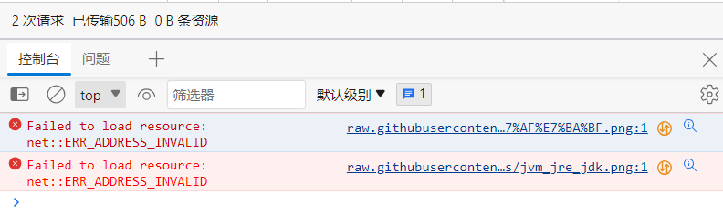
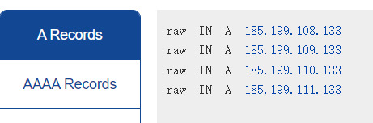
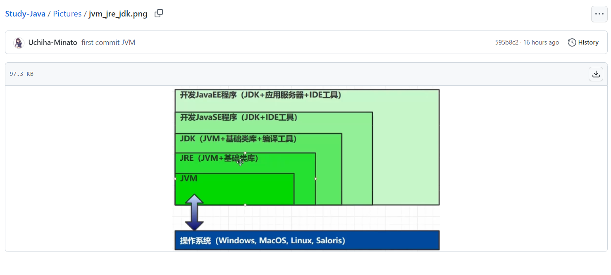
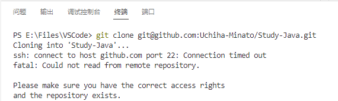

## 1.GitHub不显示图片

原因：被墙，dns污染

解决步骤
    
1）查raw.githubusercontent.com的ip

2）修改系统中的C:\Windows\System32\drivers\etc 下的 hosts 文件

    Windows 11 22H2
    终端管理员 输入notepad 以管理员身份打开记事本再修改

3）打开cmd，输入ipconfig/flushdns刷新dns解析缓存，刷新页面即可

## 2.Windows terminal 进入带空格的路径

    cd "路径名"

## 3.git克隆、推送等操作超时

异常如图：

解决方案：

https://blog.csdn.net/weixin_45637036/article/details/106560217

